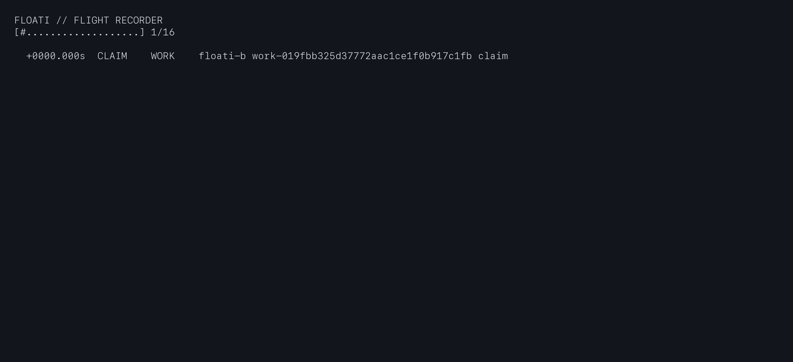
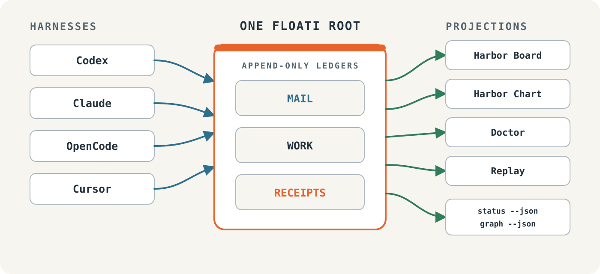
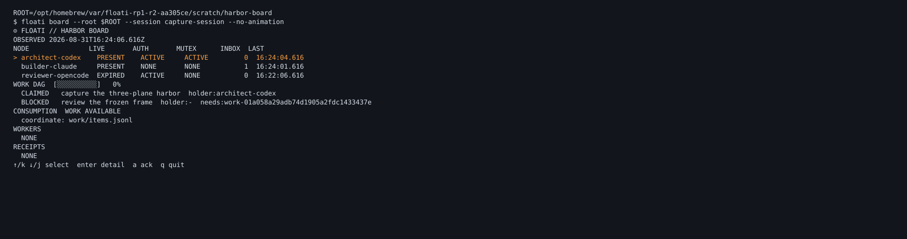
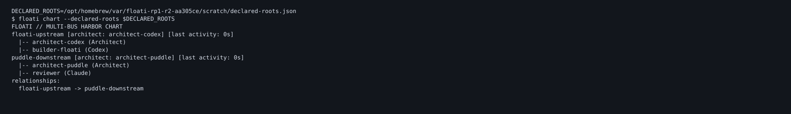
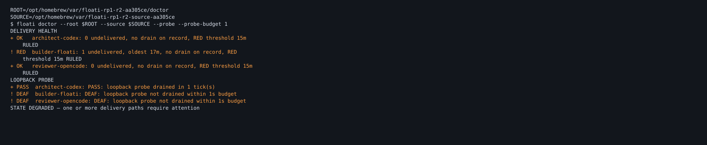
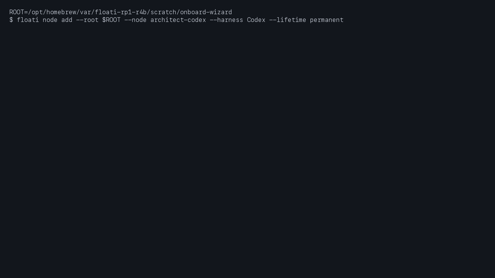
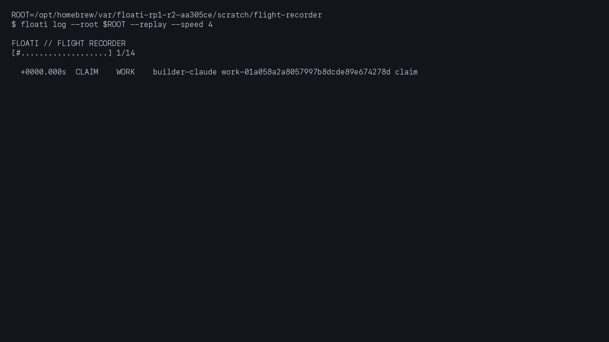
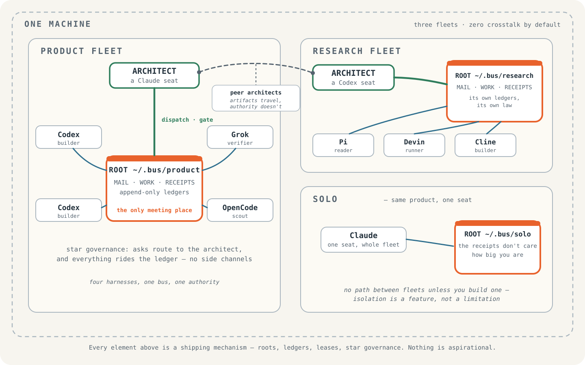

<p align="center">
  <picture>
    <source media="(prefers-color-scheme: dark)" srcset="docs/assets/floati-icon.svg#gh-dark-mode-only">
    <source media="(prefers-color-scheme: light)" srcset="docs/assets/floati-icon.svg#gh-light-mode-only">
    
  </picture>
</p>

<h1 align="center">Floati</h1>
<p align="center"><strong>The fleet operating system for local coding agents.</strong></p>
<p align="center">Any harness, any mix — one bus, one board, one set of receipts.</p>

<p align="center">
  
  
  
</p>

You're already running a fleet. An agent in Codex, two in Claude,
one in OpenCode, something experimental in Cursor — each in its own
terminal, each with its own dialect, none of them aware the others
exist. You are the bus, the scheduler, and the guy who checks
whether anything died.

Floati takes those jobs. Register your agents as nodes — whatever
harness they run in — and they share one bus: dispatch work, message
each other with full provenance, wake when mail lands, and show up
on one board. Cross-harness fleets are the whole point; a
Codex worker, a Claude reviewer, and an OpenCode scout in one
orchestrated plan is a Tuesday.

<p align="center">
  
</p>

A worker killed, a sequencer killed, a reboot — and every event
reconstructed from receipts, in order, on demand. Nothing here is
animated by the demo; it is played back from the fleet's own
records.

<sub>Every moving image in this README is a real capture of a real fleet.</sub>

## What it runs with

Floati is worth installing for a single harness: a durable work log,
receipts, and a board for your own sessions. Cross-harness fleets
are the superpower, not the entry fee.

<!-- capability-matrix:begin — GENERATED from docs/capability-matrix.v0.json by
     scripts/capability-matrix-render.py; edit the dataset, rerun the script.
     Every cell links the receipt that earned it; no cell says more than its receipt. -->
Every harness on this bus shares an append-only ledger, replay, doctor, receipts, and typed refusals — those do not vary by surface.

Orchestrators (t3, herdr) run other harnesses inside themselves. Floati reads the orchestrator's own surface - its sessions and panes are the truth when agents run there. The harnesses underneath keep their own rows and their own receipts; supporting them is a different promise than supporting the orchestrator.

Surface rows are the reference machine's MEASURED installs (C0-DELTA photograph), not the product catalog. Two absences are deliberate, not oversights: Claude.app is desktop chat, not a Claude Code seat - classified out, the same cut that separates ChatGPT Classic from Codex; and no Codex IDE extension was installed at photograph time - that row lands when the MX-1 campaign photographs one, not before.

**CLI surfaces**

| harness | bus | work | wake | notes |
|---|---|---|---|---|
| codex | [live](docs/evidence/conformance/C1-codex-conformance-live.md) | [adapter](docs/evidence/conformance/C1-codex-conformance-live.md) | [daemon](docs/evidence/gauntlet/MX1-codex-cli-wake.md) ● | deep integrations below |
| claude | [live](docs/evidence/conformance/C2-claude-conformance-live.md) | [adapter](docs/evidence/conformance/C2-claude-conformance-live.md) | [daemon](docs/evidence/gauntlet/H-claude-wake-remeasure-2-2026-08-29.md) ● | confirmed at 2.1.238 (re-measured 08-29) |
| opencode | [live](docs/evidence/conformance/C3-opencode-conformance-live.md) | [adapter](docs/evidence/conformance/C3-opencode-conformance-live.md) | [event-driven](docs/evidence/gauntlet/H-wake-posture-matrix.md) ● | 3-cycle live hold |
| cursor | [live](docs/evidence/conformance/C4-cursor-conformance-live.md) | [adapter](docs/evidence/conformance/C4-cursor-conformance-live.md) | [daemon](docs/evidence/gauntlet/MX1-cursor-cli-wake.md) ● |  |
| cline | [live](docs/evidence/conformance/C5-cline-conformance-live.md) | [adapter](docs/evidence/conformance/C5-cline-conformance-live.md) | [event-driven](docs/evidence/gauntlet/MX1-cline-cli-wake.md) ● |  |
| grok | [live](docs/evidence/conformance/C6-grok-build-conformance.md) | [adapter](docs/evidence/conformance/C6-grok-build-conformance.md) | [daemon](docs/evidence/gauntlet/MX1-grok-cli-wake.md) ● | via installed grok binary |
| pi | [live](docs/evidence/conformance/C7-pi-conformance-live.md) | [adapter](docs/evidence/conformance/C7-pi-conformance-live.md) | [event-driven](docs/evidence/gauntlet/MX1-pi-cli-wake.md) ● |  |
| zcode | [—](docs/evidence/gauntlet/ZC1-zcode-scoping-photograph.md) | [—](docs/evidence/gauntlet/ZC1-zcode-scoping-photograph.md) | [daemon](docs/evidence/gauntlet/MX1-zcode-cli-wake.md) ● | wake measured on arrival; the Stop-hook path is superseded by the daemon |
| herdr | [live](docs/evidence/conformance/C8-herdr-conformance-live.md) | [—](docs/evidence/wave2-r3-herdr-loopback-client-2026-08-27.md) | [n/a](docs/evidence/gauntlet/H-wake-posture-matrix.md) | orchestrator; observation adapter live |
| t3 | [CLI](docs/evidence/conformance/C9-t3-compatibility-live.md) | [—](docs/evidence/conformance/C9-t3-compatibility-live.md) | [event-driven](docs/evidence/gauntlet/MX1-t3-cli-wake.md) ● | orchestrator; observed via its own surface |
| devin | [CLI](docs/evidence/conformance/C11-devin-conformance-live.md) | [—](docs/evidence/conformance/C11-devin-conformance-live.md) | [event-driven](docs/evidence/gauntlet/MX1-devin-cli-wake.md) ● | CLI-compat tier |
| antigravity | [CLI](docs/evidence/conformance/C12-antigravity-conformance-live.md) | [—](docs/evidence/conformance/C12-antigravity-conformance-live.md) | [event-driven](docs/evidence/gauntlet/MX1-antigravity-cli-wake.md) ● | CLI-compat tier |

**Desktop / GUI surfaces**

| harness / surface | wake | notes |
|---|---|---|
| codex / desktop | [daemon](docs/evidence/gauntlet/H-wake-posture-surfaces.md) ○ | ChatGPT.app |
| claude / desktop-chat | [n/a](docs/evidence/gauntlet/H-wake-posture-surfaces.md) | chat app, not a seat - Claude seats run in the CLI or IDE extension |
| claude / ide-extension | [daemon](docs/evidence/gauntlet/H-wake-posture-surfaces.md) ○ | extension ≠ CLI; own row by design |
| opencode / desktop | [event-driven](docs/evidence/gauntlet/H-wake-posture-surfaces.md) ○ |  |
| cursor / desktop | [daemon](docs/evidence/gauntlet/H-wake-posture-surfaces.md) ● | the measuring seat itself |
| grok / desktop | [n/a](docs/evidence/gauntlet/H-wake-posture-surfaces.md) |  |
| t3 / desktop | [event-driven](docs/evidence/gauntlet/H-wake-posture-surfaces.md) ○ |  |
| antigravity / desktop | [daemon](docs/evidence/gauntlet/H-wake-posture-surfaces.md) ○ | not inherited from its CLI |

● measured live · ○ classified from surfaces (the unexercised probe is named in the receipt) · — no receipt yet: we do not claim what we have not measured.

**Deep integrations (codex):** [session boot](docs/evidence/WS-D3-NODE-LIFECYCLE-PROJECTION-WIRING.md) · [managed send](docs/evidence/gate-wsb-b5-2026-08-27.md) — receipt-linked notes rather than grid columns, so one harness's head start does not read as everyone else's gap. The full 19-surface grid, every cell receipt-linked, lives in [docs/capability-matrix.md](docs/capability-matrix.md).
<!-- capability-matrix:end -->

Platforms: macOS today. Anything POSIX is intended; a platform joins
this list the same way a harness does — with receipts.

<p align="center">
  <picture>
    <source media="(prefers-color-scheme: dark)" srcset="docs/assets/floati-architecture-dark.svg">
    <source media="(prefers-color-scheme: light)" srcset="docs/assets/floati-architecture-light.svg">
    
  </picture>
</p>

One picture: harnesses at the edge, one append-only ledger in the
middle, projections derived from it — never a second source of
truth.

## What you can do with it

### Talk to your fleet

```bash
floati send --root /absolute/fleet --from architect --to builder-a \
  --repo myapp --sha <40-hex> --doc docs/briefs/row-1.md --note "Row 1 is yours."
```

Every message is a typed envelope with provenance — sender,
recipient, tenant, repo, SHA — validated on the way in, refused when
malformed. Delivery, acknowledgment, and consumption are separate
records, so "did they get it?" has an actual answer.

### Wake the lane you just dispatched

Stop-hook waiters for your harnesses and an optional per-fleet
daemon mean a dispatched lane wakes in seconds — not whenever
someone remembers to check a terminal. Wake is opt-in per fleet,
armed by a consent receipt, off by default: nothing wakes without
your recorded say-so. And a floati waiter is a polite neighbor —
instant silent exit for any workspace that isn't its own, other
buses' hooks and mail never touched.

### Orchestrate across harnesses

```bash
floati orchestrate --root /absolute/fleet --plan /absolute/plan.json --adapter codex --deadline 120
```

Plans fan work across registered workers with dependency edges —
work stays `BLOCKED` until prerequisites complete. Workers can live
in different harnesses; the adapter layer speaks each one's dialect
so the plan doesn't have to. Degradation is typed, and drain refuses
to declare victory until work state, terminal receipts, controller
exits, and descendant cleanup audits all agree.

### See the whole harbor

<p align="center">
  
</p>

The Harbor Board: liveness, authority, and lock state as three
separate lamps — three different questions, never blended into one
green dot. Keyboard-first, redraws only on state change.

<p align="center">
  
</p>

Running more than one fleet on this machine? Declare your roots
(floati never scans your disk) and `floati chart` draws the harbor:
buses, nodes, architect seats, what's downstream, last activity.
`floati survey` goes further — it reports agent buses on this
filesystem that floati did *not* install, including whether a
foreign waiter is bound to one of your workspaces. Read-only, on
your request.

### Know which lane went deaf — and which step died

<p align="center">
  
</p>

"The lane went quiet" is not a diagnosis. The doctor states per-node
undelivered counts, oldest-message age, and last drain even when
everything is green, and `doctor --probe` sends a self-addressed
envelope through a node's own delivery path to prove it can still
hear — without touching anyone else's mail.

### Onboard and tear down nodes like it's nothing

<p align="center">
  
</p>

`floati node add` walks you through a new node: identity, harness,
permanent or temporary. Temporary nodes boot with one command and
tear down with one. Switching a node between providers or models is
a recorded reassignment, not a re-onboarding. Every
wizard step prints the exact records it will write before writing
them — the wizard fronts the same verbs you could type, never a
second path. Nodes keep their working folders nested under the
fleet root, so ten agents don't mean ten directories strewn across
your home.

### Give every node a role

A fleet isn't just processes — it's an architect, reviewers,
builders, scouts, each needing the right boot instructions and a
clean hand-off ritual when a session ends. Floati generates and
explains boot and wind-down commands per node from its role, runs
them where the harness allows, and keeps them current as the fleet
changes — so standing up your whole fleet stops being an act of
memory.

### Treat context like the resource it is

Agent sessions degrade as their context fills, and every harness
handles it differently. Floati tracks what each harness actually
exposes, hands a lane a turnover ritual before it drowns — wind
down, port the working state, boot the successor — and never
invents a pressure number it can't measure.

### Replay any run

<p align="center">
  
</p>

The flight recorder replays a finished run as an ordered timeline:
claims, worker turns, degradations, denials, completions. Playback
speed changes the waiting, never the order.

### Bring your agent — or be the human

Humans and agents are both first-class operators here. Point your
agent at this repo: `AGENTS.md` is its manual, every verb
self-describes in JSON, every refusal names its remedy, and every
action leaves a receipt your agent can verify — it never has to
guess whether its own message arrived. The keyboard-first flows and
the declarative `--json` flows are the same engine wearing two
idioms, so your fleet reads identically whether you run it or your
agent does.

## Why it doesn't fall over

Every harness already writes a session log. Those are per-harness,
mutable, uncorrelated, and they can't answer a fleet question. Under
floati, everything above runs on one append-only, typed ledger —
the board, the chart, the doctor, the replay are all projections of
it, and if a projection ever disagrees with the receipts, the
receipts win. Kill a worker, kill the sequencer, reboot the machine: nothing is
lost and nothing lies — the ledger survives every fault, the whole
run replays on demand, and floati refuses to continue past what it
cannot prove, telling you exactly why in a typed exit code.
Ambiguous identity, expired authority, malformed envelopes — same
answer: refusal with a reason, never a guess.

No telemetry. Nothing leaves this machine — measured, not promised:
the only network-class socket in the product dials loopback on your
own machine, behind explicit consent, and cannot listen.

The full promise — and precisely what floati refuses to guess — is
written down: **[Truth Guarantees](docs/TRUTH-GUARANTEES.md)**. If a
promise on that page can't be demonstrated by a test or a receipt,
it doesn't belong on it.

## What it costs to run

Almost nothing is resident. Every floati verb runs to completion and
exits — the board, the doctor, a send, a drain are processes that
live for one command. There is no service, no tray icon, no
background indexer. The one exception is opt-in: a wake daemon you
explicitly consent to, per seat, with poll bounds you set at consent
time — and revoking it removes the process, provably.

The readers stay fast at hostile scale — measured, not promised.
At 10,000 work items and 100,000 ledger events:

| Reader | Median | Budget |
| --- | ---: | ---: |
| inbox | 34 ms | <100 ms |
| status | 76 ms | <150 ms |
| replay render start | 47 ms | <300 ms |
| board full redraw | 92 ms | <250 ms |
| doctor | 116 ms | <2,000 ms |

Receipts: [the gauntlet record](docs/evidence/HM3H-GAUNTLET.md),
budgets and harness unchanged between runs.

One number we have not measured yet, so we will not print one: the
wake daemon's resident footprint over a long window. It is a small
polling process with ruled bounds, but "small" is not a
measurement — that receipt is queued, and this section gets the
number when the number exists.

## Start alone

Every durable command names an explicit absolute root. There is no
default root, no home scan, and nothing that wakes without you.
Point it somewhere; that directory is the entire blast radius.

```bash
floati init --root /absolute/my-sessions --solo me --harness Codex
floati work add --root /absolute/my-sessions --title "Record this session"
floati board --root /absolute/my-sessions
```

## Grow the fleet

```bash
floati node add --root /absolute/fleet --node builder-a --harness Codex --lifetime permanent
floati orchestrate --root /absolute/fleet --plan /absolute/plan.json --adapter codex --deadline 120
floati log --root /absolute/fleet --replay --speed 4
```

The installed child harness owns its own provider traffic and
credentials; floati opens no network connection and reads no
credential.

And a fleet is not the ceiling. One machine can run several — different harness
mixes, an architect seat in each, peer architects exchanging artifacts but never
authority, and no path between fleets unless you build one:

<picture>
    <source media="(prefers-color-scheme: dark)" srcset="docs/assets/floati-multifleet-dark.svg">
    <source media="(prefers-color-scheme: light)" srcset="docs/assets/floati-multifleet-light.svg">
    
</picture>

Every element in that picture is a shipping mechanism — roots, ledgers, leases,
star governance. Nothing is aspirational.

## Leave cleanly

Every door in floati has an exit beside it, at equal polish: pause
the wake, retire the node, drain the run, uninstall the tool —
each one obvious, each one receipted, none of them touching your
records. A product that's sure of its worth doesn't make leaving
hard.

```bash
floati uninstall --destination /absolute/install --dry-run
```

Manifest-exact removal with receipts. Files floati did not install
are never touched, and your ledgers are never part of an uninstall —
the record outlives the tool, which is rather the point of a record.

## Compose with it

`floati status --root /absolute/fleet --json` is the stable
version-zero machine contract; `floati graph --json` is its topology
twin. `docs/CONFLUENCE-v0.md` and its JSON Schemas define the
read-only seam for downstream consumers — a GUI, a dashboard, or
anything that wants to draw your harbor in glass instead of ASCII.

## Verify

```bash
python3 -m unittest discover
python3 -m floati.selftest
python3 -m floati.conformance --live-root-smoke
```

Visible CLI language is generated into `docs/COPY-LEDGER.md`. Hosted
CI, deployment, and release are separate gates; a local green suite
doesn't manufacture them.

Product code is AGPL-3.0; the interchange schemas and bundle
specifications are Apache-2.0.
