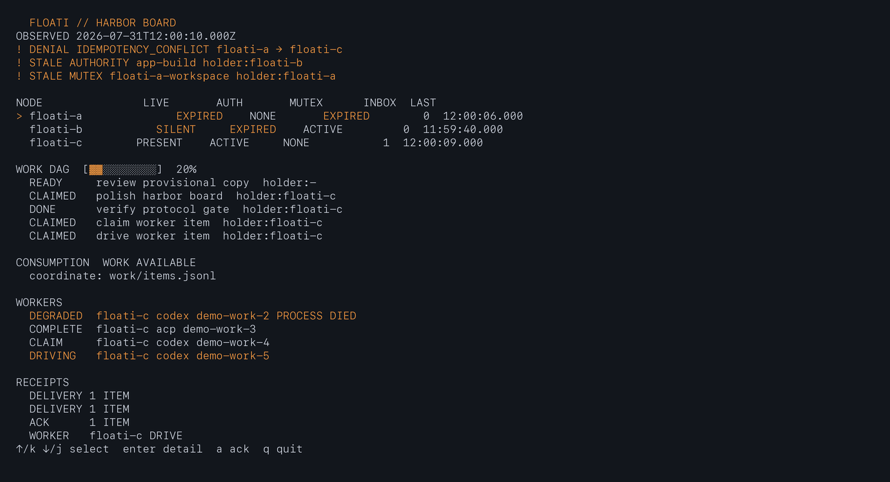
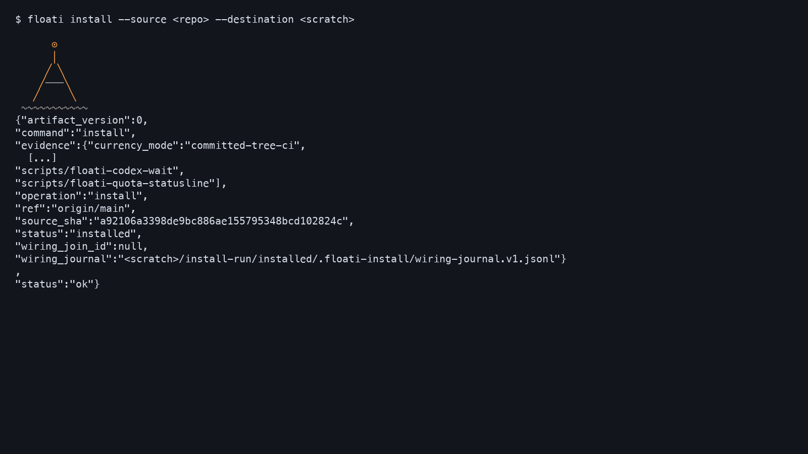
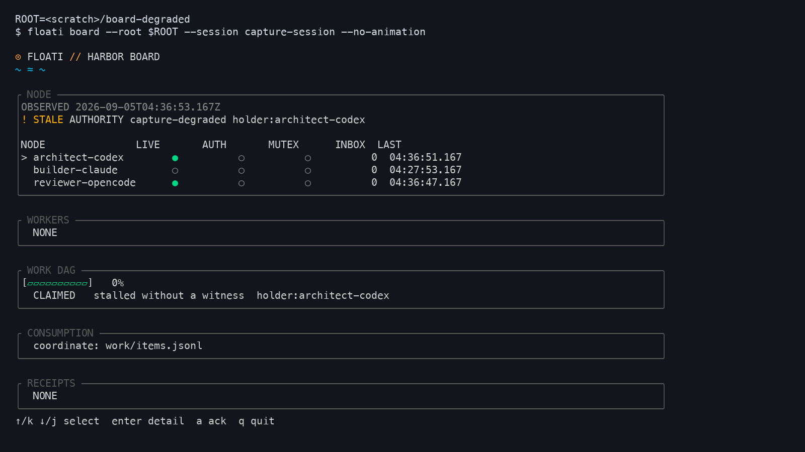
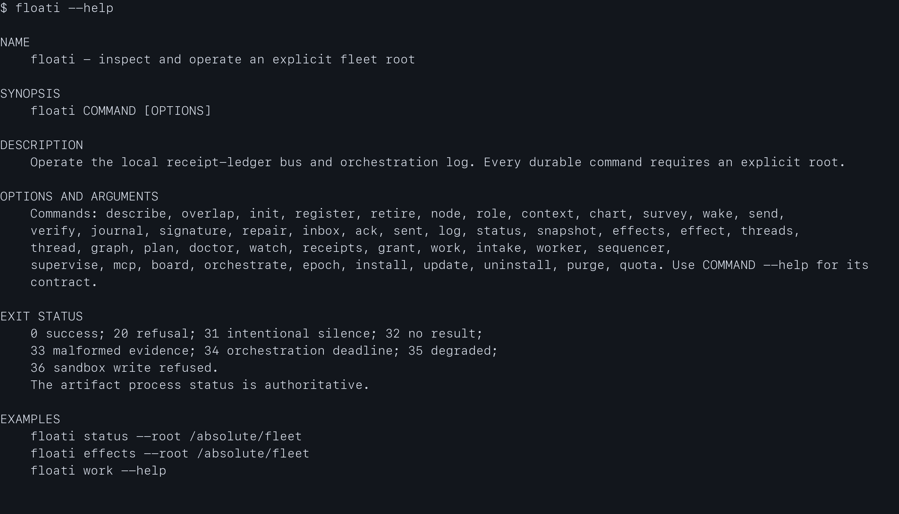
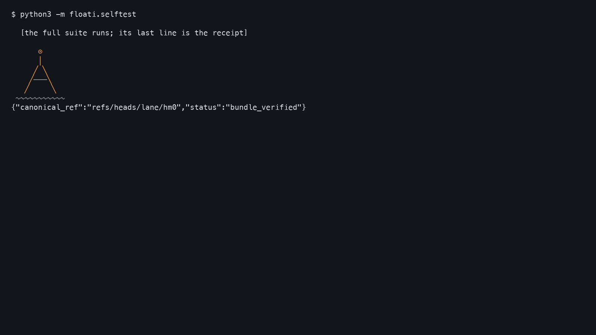

<p align="center">
  <picture>
    <source media="(prefers-color-scheme: dark)" srcset="docs/assets/floati-icon.svg#gh-dark-mode-only">
    <source media="(prefers-color-scheme: light)" srcset="docs/assets/floati-icon.svg#gh-light-mode-only">
    
  </picture>
</p>

<h1 align="center">
  <picture>
    <source media="(prefers-color-scheme: dark)" srcset="docs/assets/floati-wordmark-dark.svg">
    <source media="(prefers-color-scheme: light)" srcset="docs/assets/floati-wordmark.svg">
    
  </picture>
</h1>
<p align="center"><strong>Keep your coding tools. Coordinate the work between them.</strong></p>
<p align="center">One bus, one board, one set of receipts, for the coding agents you already run.</p>
<p align="center"><strong>Point your coding agent at this repository. <a href="AGENTS.md"><code>AGENTS.md</code></a> walks it from install to a verified fleet.</strong></p>

<p align="center">
  
  
  <a href="#what-it-runs-with"></a>
</p>

<p align="center">
  <a href="#start-here">Start here</a> ·
  <a href="#what-you-get">What you get</a> ·
  <a href="#what-it-runs-with">What it runs with</a> ·
  <a href="#how-it-holds-up">How it holds up</a> ·
  <a href="#what-is-still-wrong">What is still wrong</a> ·
  <a href="docs/ROADMAP.md">Roadmap</a>
</p>

You are already running a fleet. An agent in Codex, two in Claude,
one in OpenCode, something experimental in Cursor. Each sits in its
own terminal with its own dialect, and none of them knows the others
exist. You are the bus, the scheduler, and the one who checks whether
anything died.

Floati takes those jobs. Register your agents as nodes, whatever
harness they run in, and they share one bus: they dispatch work,
message each other with full provenance, and show up on one board.
A Codex worker, a Claude reviewer and a scout in a third harness in
one plan is the normal case, not the demo.

<p align="center">
  
</p>

The Harbor Board. Liveness, authority and lock state are three
separate lamps, because they are three different questions. Every
terminal image on this page is a capture from a real ledger or a
declared fixture, listed with its SHA-256 in the manifest beside it;
the drawings illustrate, the captures measure. If you want to see
what an agent can do with it, point yours at
[`AGENTS.md`](AGENTS.md); it walks from install to a verified fleet.

## Start here

Floati is one Python package with no third-party runtime dependencies.
`pyproject.toml` sets the floor: Python 3.9 or newer.
Clone it and let it install itself into a directory you choose:

```bash
git clone https://github.com/Land-o-Clusters/floati.git /absolute/floati
git -C /absolute/floati checkout v0.1.2
python3 -m floati install --source /absolute/floati --destination /absolute/install --ref v0.1.2
```

`/absolute/install/scripts/floati` is the command; add that `scripts`
directory to your `PATH` or call it by path. Leave out `checkout` and
`--ref` to install whatever `main` is today.

<p align="center">
  
</p>

Now make your first record. Every durable command names an absolute
root; there is no default root and nothing scans your home directory.

```bash
floati init --root /absolute/my-sessions --solo me --harness Codex
floati work add --root /absolute/my-sessions --title "Record this session"
floati work show --root /absolute/my-sessions
floati board --root /absolute/my-sessions
```

`work show` lists "Record this session". That is your first durable
record, and no agent process or wake hook was needed to make it.
`floati doctor --root /absolute/my-sessions --source /absolute/floati --destination /absolute/install`
tells you whether what is on disk still matches the manifest, file by
file, and names each finding with its remedy.

To grow past one seat, add a node and give it work:

```bash
floati node add --root /absolute/my-sessions --node builder-a --harness Codex --lifetime permanent
floati send --root /absolute/my-sessions --from me --to builder-a \
  --repo myapp --sha <40-hex> --doc docs/briefs/row-1.md --note "Row 1 is yours."
floati receipts builder-a --root /absolute/my-sessions
```

`node add` prints the exact records it will write before writing
them. `receipts` shows delivery, acknowledgment and consumption as
three separate histories, so "did they get it?" has an actual answer.
Plans with dependency edges across several workers are
`floati orchestrate`; today it takes one adapter, `codex`, while the
fleet underneath it can be any mix.

## What you get

**A bus with provenance.** Every message is a typed envelope: sender,
recipient, tenant, repository, commit. It is validated on the way in
and refused, with a typed code, when malformed. Delivered,
acknowledged and consumed are three records; a refusal is a fourth.

**A board that says which thing is wrong.**

<p align="center">
  
</p>

One presence lapsed, one lease ran out, one claim stalled without a
witness. Each is named, with its holder, on the line where it lives.
Green is live, amber is a lease running out, an empty ring is a node
that has not been seen. `floati graph` draws the same fleet as a
dependency picture; `floati chart` draws every fleet you have declared
on this machine; `floati watch` streams the board's changes as text.


**A doctor that reports absence, not guesses.** "The node went quiet"
is not a diagnosis. `floati doctor` states per-node undelivered
counts, oldest-message age and last drain. `doctor --probe` sends a
self-addressed envelope through each node's own delivery path and
reports PASS or DEAF per node. A node with no waiter armed is
DEAF by definition; the probe reports the fact and does not know
whether you meant it. Liveness is a separate question: `floati presence report`
is a node reporting about itself, and an expired report means *no
report since*, never *down*.

**A flight recorder.**

<p align="center">
  
</p>

A worker killed, a sequencer killed, a reboot, and every event
reconstructed from receipts, in order, on demand. `floati log --replay`
plays back any finished run the same way: claims, worker turns,
degradations, denials, completions. Playback speed changes the
waiting, never the order.

**Wake, when you ask for it.** Stop-hook waiters and an optional
per-fleet daemon mean a dispatched node can wake when mail lands. Wake
is off by default, armed per fleet by a consent receipt
(`floati wake arm`), and `floati wake status` shows exactly what is
armed. Which harnesses wake reliably today is measured, not assumed;
see [What it runs with](#what-it-runs-with) and the open issues.

**Roles, context and intake.** `floati node explain` generates and
explains boot and wind-down commands per node from its role. Context
is tracked per harness (`floati context policy`), a node is handed a
recorded turnover when its context fills, and no pressure number is
invented that cannot be measured. `floati intake` snapshots a GitHub
issue or a local Markdown file as the source of a work item.

### Bring your agent, or be the human

<p align="center">
  
</p>

Humans and agents are both first-class operators here. Point your
agent at this repo: [`AGENTS.md`](AGENTS.md) is its manual, every verb
self-describes in JSON (`floati describe --json`), every refusal
carries a typed code and a detail, and every action leaves a receipt
your agent can verify. It never has to guess whether its own message
arrived. `floati mcp serve` exposes the same verbs to an MCP client
as tools, with the node identity pinned at launch so the client
cannot speak as anyone else. The keyboard-first flows and the
declarative `--json` flows are the same engine, so your fleet reads
identically whether you run it or your agent does.

<picture>
    <source media="(prefers-color-scheme: dark)" srcset="docs/assets/floati-multifleet-dark.svg">
    <source media="(prefers-color-scheme: light)" srcset="docs/assets/floati-multifleet-light.svg">
    
</picture>

Every element in that picture is a shipping mechanism: roots,
ledgers, leases, star governance.

## What it runs with

Floati is worth installing for a single harness: a durable work log,
receipts and a board for your own sessions. Cross-harness fleets are
the point, not the entry fee.

Twelve harnesses have been measured. **What each can do varies by
surface.** Messaging, observation, wake and managed execution are
four different capabilities, and a harness that has one does not
automatically have the rest. In the tables below a filled dot is a
live measurement, a hollow dot is a classification from the surface
with the unexercised probe named in its receipt, and a dash means no
receipt yet. The methodology behind the tables is in
[docs/capability-matrix.md](docs/capability-matrix.md).

<!-- capability-matrix:begin — GENERATED from docs/capability-matrix.v0.json by
     scripts/capability-matrix-render.py; edit the dataset, rerun the script.
     Every cell links the receipt that earned it; no cell says more than its receipt. -->
Every harness on this bus shares an append-only ledger, replay, doctor, receipts, and typed refusals — those do not vary by surface.

Orchestrators (t3, herdr) run other harnesses inside themselves. Floati reads the orchestrator's own surface - its sessions and panes are the truth when agents run there. The harnesses underneath keep their own rows and their own receipts; supporting them is a different promise than supporting the orchestrator.

Surface rows are the reference machine's MEASURED installs (C0-DELTA photograph), not the product catalog. Two absences are deliberate, not oversights: Claude.app is desktop chat, not a Claude Code seat - classified out, the same cut that separates ChatGPT Classic from Codex; and no Codex IDE extension was installed at photograph time - that row lands when the MX-1 campaign photographs one, not before.

Version honesty: claude/cli declared current [2.1.251 (Claude Code) at 2026-09-03](docs/evidence/conformance/C2-claude-cli-version-2026-09-03.md); cells marked `version_stale: true` were measured at 2.1.231 (Claude Code) at 2026-08-27 and 2026-08-28 and keep those receipt-bound stamps.

**CLI surfaces**

| harness | bus | work | wake | notes |
|---|---|---|---|---|
| codex | [live](docs/evidence/conformance/C1-codex-conformance-live.md) | [adapter](docs/evidence/conformance/C1-codex-conformance-live.md) | [daemon](docs/evidence/gauntlet/MX1-codex-cli-wake.md) ● | deep integrations below |
| claude | [live](docs/evidence/conformance/C2-claude-conformance-live-2026-09-04.md) | [adapter](docs/evidence/conformance/C2-claude-conformance-live-2026-09-04.md) | [daemon](docs/evidence/conformance/H-claude-wake-remeasure-2026-09-04.md) ● | confirmed at 2.1.251 (re-measured 09-04) |
| opencode | [live](docs/evidence/conformance/C3-opencode-conformance-live.md) | [adapter](docs/evidence/conformance/C3-opencode-conformance-live.md) | [event-driven](docs/evidence/gauntlet/H-wake-posture-matrix.md) ● | 3-cycle live hold |
| cursor | [live](docs/evidence/conformance/C4-cursor-conformance-live.md) | [adapter](docs/evidence/conformance/C4-cursor-conformance-live.md) | [daemon](docs/evidence/gauntlet/MX1-cursor-cli-wake.md) ● |  |
| cline | [live](docs/evidence/conformance/C5-cline-conformance-live.md) | [adapter](docs/evidence/conformance/C5-cline-conformance-live.md) | [event-driven](docs/evidence/gauntlet/MX1-cline-cli-wake.md) ● |  |
| grok | [live](docs/evidence/conformance/C6-grok-build-conformance.md) | [adapter](docs/evidence/conformance/C6-grok-build-conformance.md) | [daemon](docs/evidence/gauntlet/MX1-grok-cli-wake.md) ● | via installed grok binary |
| pi | [live](docs/evidence/conformance/C7-pi-conformance-live.md) | [adapter](docs/evidence/conformance/C7-pi-conformance-live.md) | [event-driven](docs/evidence/gauntlet/MX1-pi-cli-wake.md) ● |  |
| zcode | [—](docs/evidence/gauntlet/ZC1-zcode-scoping-photograph.md) | [—](docs/evidence/gauntlet/ZC1-zcode-scoping-photograph.md) | [daemon](docs/evidence/gauntlet/MX1-zcode-cli-wake.md) ● | wake measured on arrival; the Stop-hook path is superseded by the daemon |
| herdr | [live](docs/evidence/conformance/C8-herdr-conformance-live.md) | [—](docs/evidence/wave2-r3-herdr-loopback-client-2026-08-27.md) | [n/a](docs/evidence/gauntlet/H-wake-posture-matrix.md) | orchestrator; observation adapter live |
| t3 | [CLI](docs/evidence/conformance/C9-t3-compatibility-live.md) | [—](docs/evidence/conformance/C9-t3-compatibility-live.md) | [event-driven](docs/evidence/gauntlet/MX1-t3-cli-wake.md) ● | orchestrator; observed via its own surface |
| devin | [CLI](docs/evidence/conformance/C11-devin-conformance-live.md) | [—](docs/evidence/conformance/C11-devin-conformance-live.md) | [event-driven](docs/evidence/gauntlet/MX1-devin-cli-wake.md) ● | CLI-compat tier |
| antigravity | [CLI](docs/evidence/conformance/C12-antigravity-conformance-live.md) | [—](docs/evidence/conformance/C12-antigravity-conformance-live.md) | [event-driven](docs/evidence/gauntlet/MX1-antigravity-cli-wake.md) ● | CLI-compat tier |

**Desktop / GUI surfaces**

| harness / surface | wake | notes |
|---|---|---|
| codex / desktop | [daemon](docs/evidence/gauntlet/H-wake-posture-surfaces.md) ○ | ChatGPT.app |
| claude / desktop-chat | [n/a](docs/evidence/gauntlet/H-wake-posture-surfaces.md) | chat app, not a seat - Claude seats run in the CLI or IDE extension |
| claude / ide-extension | [daemon](docs/evidence/gauntlet/H-wake-posture-surfaces.md) ○ | extension ≠ CLI; own row by design |
| opencode / desktop | [event-driven](docs/evidence/gauntlet/H-wake-posture-surfaces.md) ○ |  |
| cursor / desktop | [stop hook](docs/evidence/conformance/C4b-cursor-stop-hook-public-clone-2026-09-11.md) ○ | `floati hook install --harness cursor` writes a project-scoped `stop` hook; the daemon wakes a headless twin, not the window (measured, `docs/evidence/cur-2-2026-09-11.md`); re-rooting the chat leaves the hook behind — work other directories by absolute path |
| grok / desktop | [n/a](docs/evidence/gauntlet/H-wake-posture-surfaces.md) |  |
| t3 / desktop | [event-driven](docs/evidence/gauntlet/H-wake-posture-surfaces.md) ○ |  |
| antigravity / desktop | [daemon](docs/evidence/gauntlet/H-wake-posture-surfaces.md) ○ | not inherited from its CLI |

● measured live · ○ classified from surfaces (the unexercised probe is named in the receipt) · — no receipt yet: we do not claim what we have not measured.

**Deep integrations (codex):** [session boot](docs/evidence/WS-D3-NODE-LIFECYCLE-PROJECTION-WIRING.md) · [managed send](docs/evidence/gate-wsb-b5-2026-08-27.md) — receipt-linked notes rather than grid columns, so one harness's head start does not read as everyone else's gap. The full 20-surface grid, every cell receipt-linked, lives in [docs/capability-matrix.md](docs/capability-matrix.md).
<!-- capability-matrix:end -->

**Platforms.** The supported experience today is macOS. The public
test suite also runs on Linux in CI, which is a claim about the
suite, not yet about a supported platform; a platform joins this page
the way a harness does, with receipts.

<p align="center">
  <picture>
    <source media="(prefers-color-scheme: dark)" srcset="docs/assets/floati-architecture-dark.svg">
    <source media="(prefers-color-scheme: light)" srcset="docs/assets/floati-architecture-light.svg">
    
  </picture>
</p>

Harnesses at the edge, one append-only ledger in the middle, and every
operator surface a projection of it.

## How it holds up

**Reliability and recovery.** Everything above runs on one
append-only, typed ledger. The board, the chart, the doctor and the
replay are projections of it, and if a projection ever disagrees with
the receipts, the receipts win. Kill a worker, kill the sequencer,
reboot: the run reconstructs from receipts, in order, on demand. What
replay does not do is also written down: a killed step is never
silently completed on resume. Reconstruction is of the record, not of
the work. `journal verify` checks the ledger's own chain,
`floati verify` reproduces a delivery claim in a fresh worktree at the
claimed commit, and nothing is deleted in place. The full list of
promises, and precisely what Floati refuses to guess, is
[Truth Guarantees](docs/TRUTH-GUARANTEES.md); a promise that cannot be
demonstrated by a test or a receipt does not belong on that page.

**Identity and authority.** Ambiguous identity, expired authority, a
malformed envelope: refusal with a reason, never a guess. Authority is
a grant with a holder, a subject, an epoch and an expiry, and a
detached signature verifies exact artifact bytes. Refusals and degraded
results print on stdout with a typed code, a detail and a `remedy`.

**Data boundaries.** No telemetry, ever. Floati's own sockets are local
pipes between its own processes, and a test refuses any `bind` or
`listen` outside one. The outbound paths are counted, and there are
exactly four: two client-only loopback dials for the herdr and t3
adapters, one HTTPS fetch for updates, and `intake adopt --source
github`, which runs the
`gh` executable you name to read one issue. The first three run only
behind an explicit consent receipt; the fourth runs only when you type
it, and it has no consent receipt of its own yet. The installed child harnesses own their own provider traffic and
credentials.

**What it costs.** Floati makes no model calls of its own; each agent
keeps its own provider cost. Almost nothing stays resident: a send, a
drain, a doctor run are processes that live for one command. Three
things stay up while you use them, each on your say-so: the wake
daemon you consent to per seat, `sequencer serve` while a run is in
flight, and `mcp serve` for as long as an agent client is attached.
The readers stay fast at scale. Measured on 2026-08-01 at 10,000 work
items and 100,000 ledger events, fix-round medians of three samples
after one warm-up, from [the gauntlet](docs/evidence/HM3H-GAUNTLET.md):

| Reader | Median | Budget |
| --- | ---: | ---: |
| inbox | 34 ms | <100 ms |
| status | 76 ms | <150 ms |
| replay render start | 47 ms | <300 ms |
| board full redraw | 92 ms | <250 ms |
| doctor | 116 ms | <2,000 ms |
| doctor --probe | budget-shaped: per node, default 60 s | per-node budget × node count |

`doctor` there is the plain report; `doctor --probe` waits its
per-node budget on top. One honest caveat: we
measured the wake daemon's cost over a long window on our own fleet on
2026-09-10 and it was not small while a seat sat paused. The fix is in
progress; until it ships, revoke the daemon for any seat you are not
using.

**Leaving.** Pause the wake, retire the node, drain the run, uninstall
the tool: each is one command, each writes a receipt, and none of them
touches your records.

```bash
floati uninstall --destination /absolute/install --dry-run
```

Removal is manifest-exact. Files Floati did not install are never
touched, your ledgers and the install wiring journal
(`.floati-install/wiring-journal.v1.jsonl`) are never part of an
uninstall, and the receipt names every retained path.

**Composing with it.** `floati status --root /absolute/fleet --json` is
the stable version-zero machine contract, and `floati graph --json`
returns the same fleet as nodes and edges. [`docs/CONFLUENCE-v0.md`](docs/CONFLUENCE-v0.md)
and its JSON Schemas define the read-only seam for a GUI, a dashboard
or anything else that wants to draw your harbor. `floati confluence
adopt` and `release` are the recorded way a downstream consumer takes
over, and hands back, a managed session.

**Verifying.**

<p align="center">
  
</p>

```bash
python3 -m floati.selftest
```

CI runs the full suite on every push to `main`; the commands for the
full local run, and the tools it needs, are in
[Contributing](CONTRIBUTING.md#the-ground-rules). How the captures on
this page were made, and why one that cannot be reproduced byte for
byte is not banked, is in [the capture inventory](docs/demo/CAPTURE-INVENTORY.md).

## What is still wrong

Every open defect we know about is an issue on this repository, filed
by us with the measurement that found it. The ones you are most
likely to meet:

- Cursor auto-wake was reported to stop after about 28 minutes of idle
  ([#14](https://github.com/Land-o-Clusters/floati/issues/14)). A controlled
  soak did not reproduce it; the stop we did reproduce was the hook's own
  wait deadline, and 0.1.2 ships a waiter that re-arms instead, measured
  from a clean public clone
  ([receipt](docs/evidence/conformance/C4b-cursor-stop-hook-public-clone-2026-09-11.md)).
  The issue stays open until that release is public.
- The Cursor hook is scoped to the workspace it was installed in. A chat
  re-rooted to another directory leaves the hook behind; work other
  directories by absolute path.
- A Codex seat whose Stop window has closed is not re-armed by the
  shipped daemon; queuing into a finished thread is not a wake
  ([#15](https://github.com/Land-o-Clusters/floati/issues/15)).
- OpenCode has no adapter yet, so its sessions are not supported in
  0.1.x ([#16](https://github.com/Land-o-Clusters/floati/issues/16)).
- `floati orchestrate` takes one adapter, `codex`.
- `effect compensate` refuses; it records side effects and does not
  undo them.
- Linux runs the suite in CI and is not yet a supported platform. From a
  fresh clone on Ubuntu the suite needs `umask 022` and a box where no other
  user already holds `<temp>/floati-work`; [`AGENTS.md`](AGENTS.md) says why.

What the product does not do yet, in the order we intend to build it,
is the [roadmap](docs/ROADMAP.md): a sequence, not a promise, and an
item leaves it only with a receipt. The operator's manual is
[`AGENTS.md`](AGENTS.md); the design and its case law are in
[`docs/DESIGN.md`](docs/DESIGN.md) and [`docs/CASE-LAW.md`](docs/CASE-LAW.md).

Product code is AGPL-3.0; the interchange schemas and bundle
specifications are Apache-2.0.
