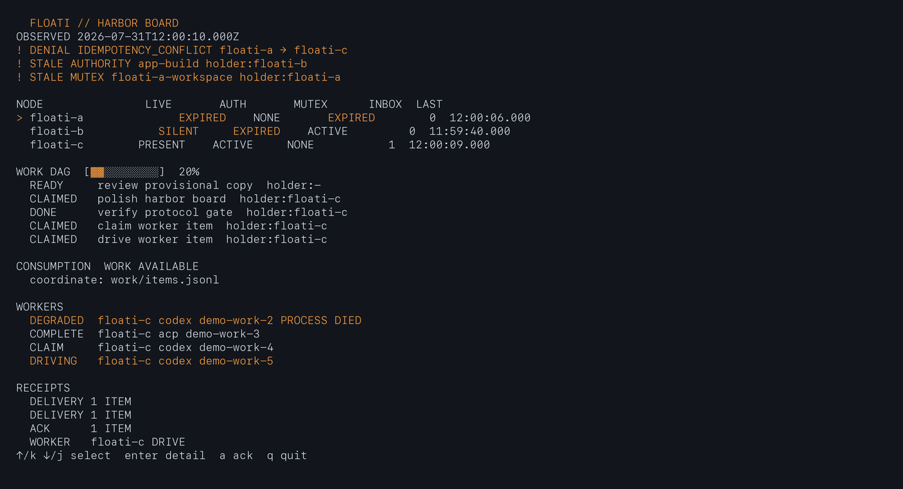
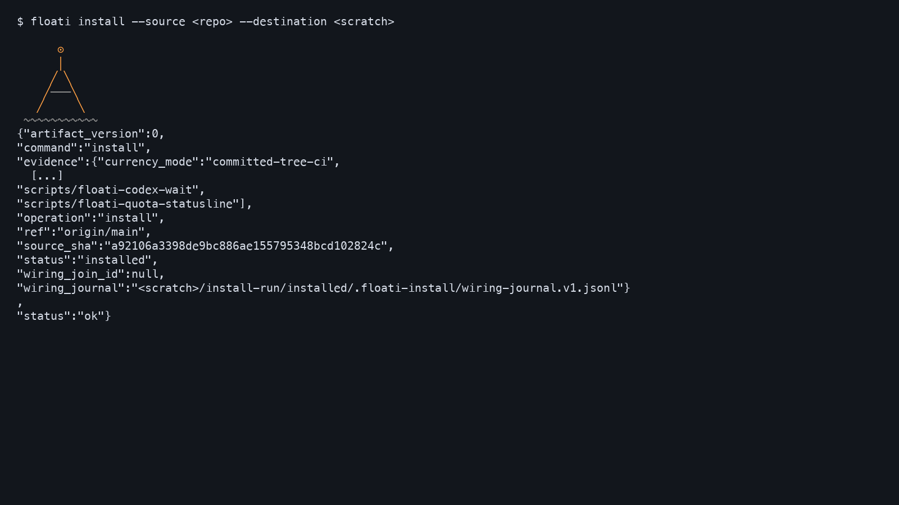
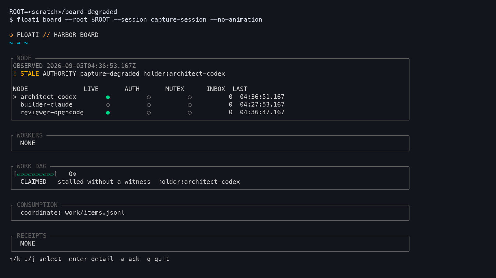
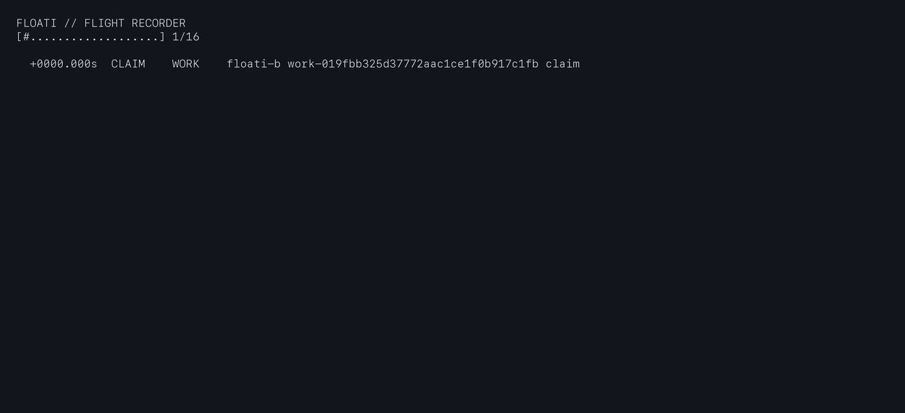
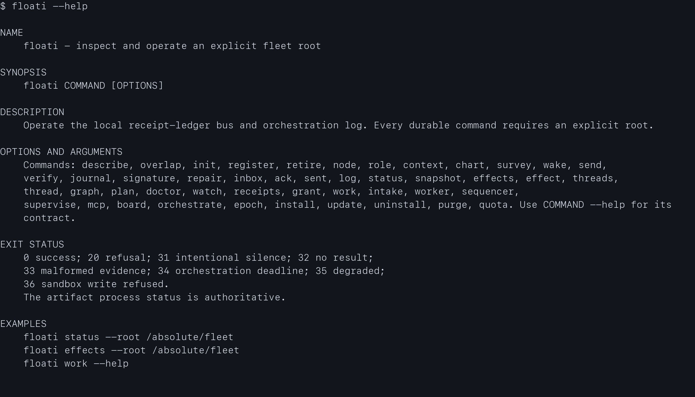
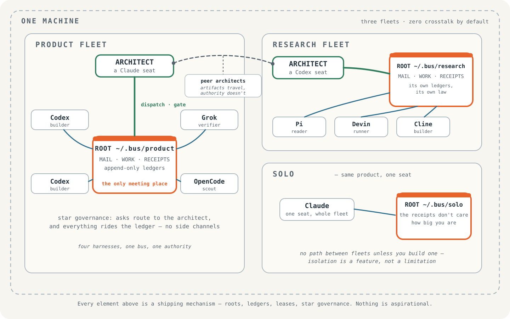
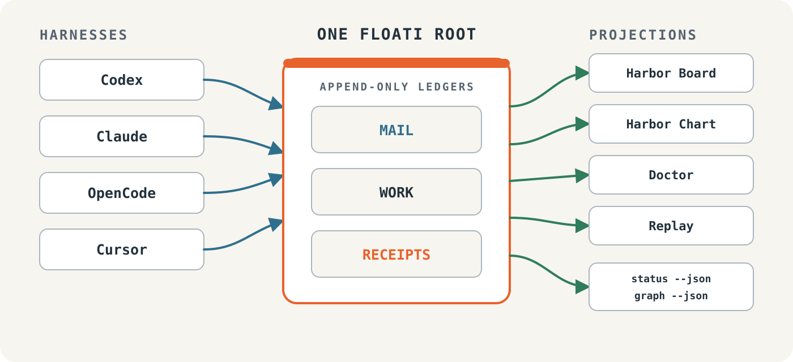
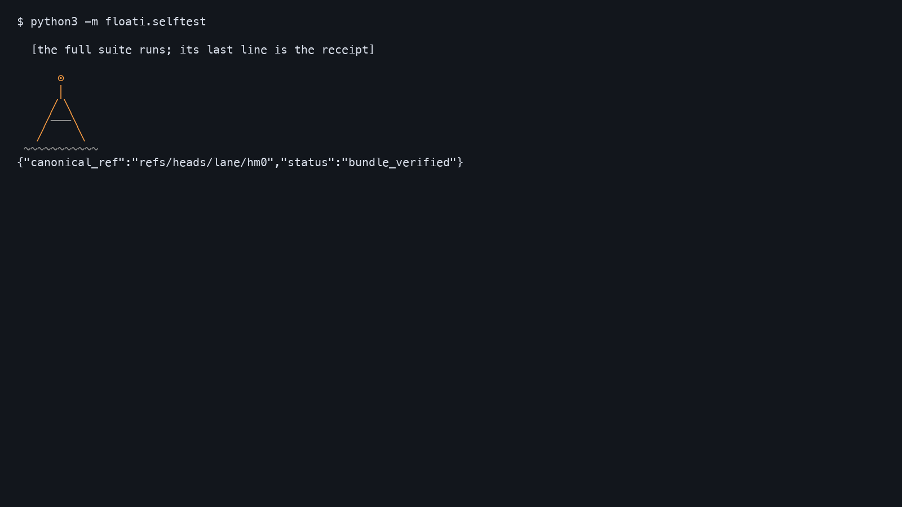

<p align="center">
  <picture>
    <source media="(prefers-color-scheme: dark)" srcset="docs/assets/floati-icon.svg#gh-dark-mode-only">
    <source media="(prefers-color-scheme: light)" srcset="docs/assets/floati-icon.svg#gh-light-mode-only">
    
  </picture>
</p>

<h1 align="center">
  <picture>
    <source media="(prefers-color-scheme: dark)" srcset="docs/assets/floati-wordmark-dark.svg">
    <source media="(prefers-color-scheme: light)" srcset="docs/assets/floati-wordmark.svg">
    
  </picture>
</h1>
<p align="center"><strong>Keep your coding tools. Coordinate the work between them.</strong></p>
<p align="center">One bus, one board, one set of receipts, for the coding agents you already run.</p>
<p align="center"><strong>Point your coding agent at this repository. <a href="AGENTS.md"><code>AGENTS.md</code></a> walks it from install to a verified fleet.</strong></p>

<p align="center">
  
  
  <a href="#what-it-runs-with"></a>
</p>

<p align="center">
  <a href="#start-here">Start here</a> ·
  <a href="#what-you-get">What you get</a> ·
  <a href="#what-it-runs-with">What it runs with</a> ·
  <a href="#how-it-holds-up">How it holds up</a> ·
  <a href="#what-is-still-wrong">What is still wrong</a> ·
  <a href="docs/ROADMAP.md">Roadmap</a>
</p>


You are already running a fleet. An agent in Codex, two in Claude,
one in OpenCode, something experimental in Cursor. Each sits in its
own terminal with its own dialect, and none of them knows the others
exist. You are the bus, the scheduler, and the one who checks whether
anything died.

Floati takes those jobs. Register your agents as nodes, whatever
harness they run in, and they share one bus: they dispatch work,
message each other with full provenance, and show up on one board.
A plan with a Codex worker, a Claude reviewer and a scout in a third
harness is the normal case.

<p align="center">
  
</p>

The Harbor Board gives liveness, authority and lock state a lamp each,
because a node can be alive with expired authority, or hold a lock
while it is down. Every
terminal image on this page is a capture from a real ledger or a
declared fixture, listed with its SHA-256 in the manifest beside it.
The drawings are illustrations; the captures are measurements. To see
what an agent can do with Floati, point yours at
[`AGENTS.md`](AGENTS.md), which walks it from install to a verified fleet.

## Start here

Floati is one Python package with no third-party runtime dependencies.
`pyproject.toml` sets the floor: Python 3.9 or newer.
Clone it and let it install itself into a directory you choose:

```bash
git clone https://github.com/Land-o-Clusters/floati.git /absolute/floati
git -C /absolute/floati checkout v0.1.2
python3 -m floati install --source /absolute/floati --destination /absolute/install --ref v0.1.2
```

The command is `/absolute/install/scripts/floati`. Add that `scripts`
directory to your `PATH` or call it by path. Leave out `checkout` and
`--ref` to install whatever `main` is today.

<p align="center">
  
</p>

Now make your first record. Every durable command names an absolute
root. No command falls back to a default root, and nothing scans your
home directory.

```bash
floati init --root /absolute/my-sessions --solo me --harness Codex
floati work add --root /absolute/my-sessions --title "Record this session"
floati work show --root /absolute/my-sessions
floati board --root /absolute/my-sessions
```

`work show` lists "Record this session". That is your first durable
record, made without an agent process or a wake hook.
`floati doctor --root /absolute/my-sessions --source /absolute/floati --destination /absolute/install`
checks what is on disk against the manifest, file by file, and names
each finding with its remedy.

To grow past one seat, add a node and give it work:

```bash
floati node add --root /absolute/my-sessions --node builder-a --harness Codex --lifetime permanent
floati send --root /absolute/my-sessions --from me --to builder-a \
  --repo myapp --sha <40-hex> --doc docs/briefs/row-1.md --note "Row 1 is yours."
floati receipts builder-a --root /absolute/my-sessions
```

`node add` prints the exact records it will write before it writes
them. `receipts` keeps delivery, acknowledgment and consumption as
three separate histories, so you can tell whether a node got the
message. Plans with dependency edges across several workers go
through `floati orchestrate`. Today it takes one adapter, `codex`;
the fleet underneath can be any mix.

## What you get

### The bus

Every message is a typed envelope naming its sender, recipient,
tenant, repository and commit. Floati validates it on the way in and
refuses a malformed one with a typed code. Delivery, acknowledgment
and consumption are each their own record, and so is a refusal.

### The board

<p align="center">
  
</p>

In this capture one presence has lapsed, one lease has run out, and
one claim has stalled without a witness. The board names each on its
own line, with its holder. Green is live, amber is a lease running
out, and an empty ring is a node nobody has seen yet. `floati graph`
draws the same fleet as a dependency picture, `floati chart` draws
every fleet you have declared on this machine, and `floati watch`
streams the board's changes as text.

### The doctor

"The node went quiet" is not a diagnosis. `floati doctor` reports each
node's undelivered count, the age of its oldest message and its last
drain. `doctor --probe` sends a self-addressed envelope through each
node's own delivery path and reports PASS or DEAF per node. A node
with no waiter armed is DEAF by definition; the probe reports that
and cannot know whether you meant it. Liveness is a separate check:
`floati presence report` is a node reporting on itself, and an
expired report means only that nothing has arrived since. It does not
mean the node is down.

### The flight recorder

<p align="center">
  
</p>

This capture kills a worker, then the sequencer, then reboots, and
rebuilds every event from receipts, in order. `floati log --replay`
plays back any finished run the same way: claims, worker turns,
degradations, denials and completions. Playback speed changes the
gaps between events; the order stays fixed.

### Wake

Stop-hook waiters and an optional per-fleet daemon let a dispatched
node wake when mail lands. Wake is off by default. You arm it per fleet
with a consent receipt (`floati wake arm`), and `floati wake status`
shows exactly what is armed. How reliably each harness wakes is
measured; see [What it runs with](#what-it-runs-with) and the open
issues.

### Roles, context and intake

`floati node explain` generates and explains each node's boot and
wind-down commands from its role. Context is tracked per harness
(`floati context policy`). When a node's context fills, it is handed a
recorded turnover, and Floati shows no context-pressure number it
cannot measure. `floati intake` snapshots a GitHub issue or a local
Markdown file as the source of a work item.

### Bring your agent, or be the human

<p align="center">
  
</p>

A person and an agent drive Floati through the same commands. Point
your agent at this repo: [`AGENTS.md`](AGENTS.md) is its manual, every
verb describes itself in JSON (`floati describe --json`), every refusal
carries a typed code and a detail, and every action leaves a receipt
your agent can check, so it can confirm its own message arrived.
`floati mcp serve` exposes the same verbs to an MCP client as tools,
with the node identity pinned at launch so the client cannot speak as
anyone else. The keyboard flows and the `--json` flows run on one
engine, so your fleet reads the same whether you drive it or your
agent does.

<picture>
    <source media="(prefers-color-scheme: dark)" srcset="docs/assets/floati-multifleet-dark.svg">
    <source media="(prefers-color-scheme: light)" srcset="docs/assets/floati-multifleet-light.svg">
    
</picture>

Everything in that picture ships today: roots, ledgers, leases and
star governance.

## What it runs with

Floati is useful with a single harness, as a durable work log with
receipts and a board for your own sessions. It was built for fleets
that span several harnesses.

Twelve harnesses have been measured, and what each one supports
depends on its surface. Messaging, observation, wake and managed
execution are four separate capabilities, and having one says nothing
about the others. In the tables below a filled dot is a live
measurement, a hollow dot is a classification from the surface with
the unexercised probe named in its receipt, and a dash means there is
no receipt yet. The method behind the tables is in
[docs/capability-matrix.md](docs/capability-matrix.md).

<!-- capability-matrix:begin — GENERATED from docs/capability-matrix.v0.json by
     scripts/capability-matrix-render.py; edit the dataset, rerun the script.
     Every cell links the receipt that earned it; no cell says more than its receipt. -->
Every harness on this bus gets the same append-only ledger, replay, doctor, receipts and typed refusals, whatever its surface.

Orchestrators (t3, herdr) run other harnesses inside themselves. Floati reads the orchestrator's own surface: when agents run there, its sessions and panes are the record. The harnesses underneath keep their own rows and receipts, because supporting a harness and supporting the orchestrator that hosts it are separate promises.

Surface rows list the installs MEASURED on the reference machine (C0-DELTA photograph). They are not a product catalog. Two rows are missing on purpose. Claude.app is a desktop chat app and cannot host a Claude Code seat, so it is classified out; the same cut separates ChatGPT Classic from Codex. No Codex IDE extension was installed when the photograph was taken, and that row arrives when the MX-1 campaign photographs one.

Version honesty: claude/cli declared current [2.1.251 (Claude Code) at 2026-09-03](docs/evidence/conformance/C2-claude-cli-version-2026-09-03.md); cells marked `version_stale: true` were measured at 2.1.231 (Claude Code) at 2026-08-27 and 2026-08-28 and keep those receipt-bound stamps.

**CLI surfaces**

| harness | bus | work | wake | notes |
|---|---|---|---|---|
| codex | [live](docs/evidence/conformance/C1-codex-conformance-live.md) | [adapter](docs/evidence/conformance/C1-codex-conformance-live.md) | [daemon](docs/evidence/gauntlet/MX1-codex-cli-wake.md) ● | deep integrations below |
| claude | [live](docs/evidence/conformance/C2-claude-conformance-live-2026-09-04.md) | [adapter](docs/evidence/conformance/C2-claude-conformance-live-2026-09-04.md) | [daemon](docs/evidence/conformance/H-claude-wake-remeasure-2026-09-04.md) ● | confirmed at 2.1.251 (re-measured 09-04) |
| opencode | [live](docs/evidence/conformance/C3-opencode-conformance-live.md) | [adapter](docs/evidence/conformance/C3-opencode-conformance-live.md) | [event-driven](docs/evidence/gauntlet/H-wake-posture-matrix.md) ● | 3-cycle live hold |
| cursor | [live](docs/evidence/conformance/C4-cursor-conformance-live.md) | [adapter](docs/evidence/conformance/C4-cursor-conformance-live.md) | [daemon](docs/evidence/gauntlet/MX1-cursor-cli-wake.md) ● |  |
| cline | [live](docs/evidence/conformance/C5-cline-conformance-live.md) | [adapter](docs/evidence/conformance/C5-cline-conformance-live.md) | [event-driven](docs/evidence/gauntlet/MX1-cline-cli-wake.md) ● |  |
| grok | [live](docs/evidence/conformance/C6-grok-build-conformance.md) | [adapter](docs/evidence/conformance/C6-grok-build-conformance.md) | [daemon](docs/evidence/gauntlet/MX1-grok-cli-wake.md) ● | via installed grok binary |
| pi | [live](docs/evidence/conformance/C7-pi-conformance-live.md) | [adapter](docs/evidence/conformance/C7-pi-conformance-live.md) | [event-driven](docs/evidence/gauntlet/MX1-pi-cli-wake.md) ● |  |
| zcode | [—](docs/evidence/gauntlet/ZC1-zcode-scoping-photograph.md) | [—](docs/evidence/gauntlet/ZC1-zcode-scoping-photograph.md) | [daemon](docs/evidence/gauntlet/MX1-zcode-cli-wake.md) ● | wake measured on arrival; the Stop-hook path is superseded by the daemon |
| herdr | [live](docs/evidence/conformance/C8-herdr-conformance-live.md) | [—](docs/evidence/wave2-r3-herdr-loopback-client-2026-08-27.md) | [n/a](docs/evidence/gauntlet/H-wake-posture-matrix.md) | orchestrator; observation adapter live |
| t3 | [CLI](docs/evidence/conformance/C9-t3-compatibility-live.md) | [—](docs/evidence/conformance/C9-t3-compatibility-live.md) | [event-driven](docs/evidence/gauntlet/MX1-t3-cli-wake.md) ● | orchestrator; observed via its own surface |
| devin | [CLI](docs/evidence/conformance/C11-devin-conformance-live.md) | [—](docs/evidence/conformance/C11-devin-conformance-live.md) | [event-driven](docs/evidence/gauntlet/MX1-devin-cli-wake.md) ● | CLI-compat tier |
| antigravity | [CLI](docs/evidence/conformance/C12-antigravity-conformance-live.md) | [—](docs/evidence/conformance/C12-antigravity-conformance-live.md) | [event-driven](docs/evidence/gauntlet/MX1-antigravity-cli-wake.md) ● | CLI-compat tier |

**Desktop / GUI surfaces**

| harness / surface | wake | notes |
|---|---|---|
| codex / desktop | [daemon](docs/evidence/gauntlet/H-wake-posture-surfaces.md) ○ | ChatGPT.app |
| claude / desktop-chat | [n/a](docs/evidence/gauntlet/H-wake-posture-surfaces.md) | chat app; Claude seats run in the CLI or IDE extension |
| claude / ide-extension | [daemon](docs/evidence/gauntlet/H-wake-posture-surfaces.md) ○ | extension ≠ CLI; own row by design |
| opencode / desktop | [event-driven](docs/evidence/gauntlet/H-wake-posture-surfaces.md) ○ |  |
| cursor / desktop | [stop hook](docs/evidence/conformance/C4b-cursor-stop-hook-public-clone-2026-09-11.md) ○ | `floati hook install --harness cursor` writes a project-scoped `stop` hook. The daemon wakes a headless twin, and the window stays asleep (measured, `docs/evidence/cur-2-2026-09-11.md`). Re-rooting the chat leaves the hook behind, so work in other directories by absolute path |
| grok / desktop | [n/a](docs/evidence/gauntlet/H-wake-posture-surfaces.md) |  |
| t3 / desktop | [event-driven](docs/evidence/gauntlet/H-wake-posture-surfaces.md) ○ |  |
| antigravity / desktop | [daemon](docs/evidence/gauntlet/H-wake-posture-surfaces.md) ○ | not inherited from its CLI |

● measured live · ○ classified from the surface, with the unexercised probe named in the receipt · `—` no receipt yet. A cell claims only what its receipt measured.

Deep integrations for codex: [session boot](docs/evidence/WS-D3-NODE-LIFECYCLE-PROJECTION-WIRING.md) · [managed send](docs/evidence/gate-wsb-b5-2026-08-27.md). These sit in a note, outside the grid, so that one harness's extra integrations do not show up as gaps for every other harness. The full 20-surface grid, every cell receipt-linked, is in [docs/capability-matrix.md](docs/capability-matrix.md).
<!-- capability-matrix:end -->

### Platforms

The supported platform today is macOS. The public test suite also runs
on Linux in CI. That tells you the suite passes there; Linux becomes a
supported platform the way a harness joins this page, with receipts.

<p align="center">
  <picture>
    <source media="(prefers-color-scheme: dark)" srcset="docs/assets/floati-architecture-dark.svg">
    <source media="(prefers-color-scheme: light)" srcset="docs/assets/floati-architecture-light.svg">
    
  </picture>
</p>

Harnesses sit at the edge and one append-only ledger sits in the
middle. Every operator surface is a projection of that ledger.

## How it holds up

### Reliability and recovery

Everything above runs on one append-only, typed ledger. The board, the
chart, the doctor and the replay are projections of it, and when a
projection disagrees with the receipts, the receipts win. Kill a
worker, kill the sequencer, reboot, and the run reconstructs from
receipts, in order, on demand. Replay has one documented limit: a step
killed mid-run is not marked complete on resume, because replay
rebuilds the record and does not redo the work. `journal verify`
checks the ledger's own chain, `floati verify` reproduces a delivery
claim in a fresh worktree at the claimed commit, and nothing is
deleted in place. Every promise, and exactly what Floati refuses to
guess, is listed in [Truth Guarantees](docs/TRUTH-GUARANTEES.md). A
promise stays on that page only if a test or a receipt demonstrates it.

### Identity and authority

Floati refuses an ambiguous identity, expired authority or a malformed
envelope, and says why. Authority is a grant with a holder, a subject,
an epoch and an expiry, and a detached signature verifies exact
artifact bytes. Refusals and degraded results print on stdout with a
typed code, a detail and a `remedy`.

### Data boundaries

No telemetry, ever. Floati's own sockets are local pipes between its
own processes, and a test refuses any `bind` or `listen` outside one.
The outbound paths are counted, and there are exactly four: two
client-only loopback dials for the herdr and t3 adapters, one HTTPS
fetch for updates, and `intake adopt --source github`, which runs the
`gh` executable you name to read one issue. The first three run only
behind an explicit consent receipt. The fourth runs only when you type
it, and it has no consent receipt of its own yet. The child harnesses
you install keep their own provider traffic and credentials.

### What it costs

Floati makes no model calls of its own; each agent keeps its own
provider cost. Almost nothing stays resident: a send, a drain or a
doctor run is a process that lives for one command. Three things stay
up while you use them, each because you started it: the wake daemon
you consent to per seat, `sequencer serve` while a run is in flight,
and `mcp serve` while an agent client is attached. The readers stay
fast at scale. These are medians of three samples after one warm-up,
measured on 2026-08-01 at 10,000 work items and 100,000 ledger events,
from [the gauntlet](docs/evidence/HM3H-GAUNTLET.md):

| Reader | Median | Budget |
| --- | ---: | ---: |
| inbox | 34 ms | <100 ms |
| status | 76 ms | <150 ms |
| replay render start | 47 ms | <300 ms |
| board full redraw | 92 ms | <250 ms |
| doctor | 116 ms | <2,000 ms |
| doctor --probe | budget-shaped: per node, default 60 s | per-node budget × node count |

`doctor` in that table is the plain report; `doctor --probe` adds its
per-node budget on top. One caveat: we measured the wake daemon's cost
over a long window on our own fleet on 2026-09-10, and it was not
small while a seat sat paused. A fix is in progress. Until it ships,
revoke the daemon for any seat you are not using.

### Leaving

Pausing the wake, retiring the node, draining the run and uninstalling
the tool are one command each. Each writes a receipt, and none of them
touches your records.

```bash
floati uninstall --destination /absolute/install --dry-run
```

Removal is manifest-exact. Floati never touches files it did not
install. Your ledgers and the install wiring journal
(`.floati-install/wiring-journal.v1.jsonl`) stay out of every
uninstall, and the receipt names every path it kept.

### Composing with it

`floati status --root /absolute/fleet --json` is the stable
version-zero machine contract, and `floati graph --json` returns the
same fleet as nodes and edges. [`docs/CONFLUENCE-v0.md`](docs/CONFLUENCE-v0.md)
and its JSON Schemas define the read-only seam for a GUI, a dashboard
or anything else that wants to draw your harbor. `floati confluence
adopt` and `release` are how a downstream consumer takes over a
managed session, and hands it back, with a record of both.

### Verifying

<p align="center">
  
</p>

```bash
python3 -m floati.selftest
```

CI runs the full suite on every push to `main`. The commands for the
full local run, and the tools it needs, are in
[Contributing](CONTRIBUTING.md#the-ground-rules). How the captures on
this page were made, and why we keep only captures we can reproduce
byte for byte, is in [the capture inventory](docs/demo/CAPTURE-INVENTORY.md).

## What is still wrong

Every open defect we know about is an issue on this repository, filed
by us with the measurement that found it. The ones you are most
likely to meet:

- Cursor auto-wake was reported to stop after about 28 minutes of idle
  ([#14](https://github.com/Land-o-Clusters/floati/issues/14)). A controlled
  soak did not reproduce it. The stop we did reproduce was the hook's own
  wait deadline, and 0.1.2 ships a waiter that re-arms instead, measured
  from a clean public clone
  ([receipt](docs/evidence/conformance/C4b-cursor-stop-hook-public-clone-2026-09-11.md)).
  The issue stays open until that release is public.
- The Cursor hook is scoped to the workspace it was installed in. A chat
  re-rooted to another directory leaves the hook behind, so work in other
  directories by absolute path.
- The shipped daemon does not re-arm a Codex seat whose Stop window has
  closed. Queuing mail into a finished thread does not wake it
  ([#15](https://github.com/Land-o-Clusters/floati/issues/15)).
- OpenCode has no adapter yet, so 0.1.x does not support its sessions
  ([#16](https://github.com/Land-o-Clusters/floati/issues/16)).
- `floati orchestrate` takes one adapter, `codex`.
- `effect compensate` refuses. It records side effects and does not
  undo them.
- Linux runs the suite in CI and is not yet a supported platform. From a
  fresh clone on Ubuntu the suite needs `umask 022` and a box where no other
  user already holds `<temp>/floati-work`; [`AGENTS.md`](AGENTS.md) says why.

The [roadmap](docs/ROADMAP.md) lists what the product does not do yet,
in the order we intend to build it. It commits to no dates, and an item
leaves it only with a receipt. The operator's manual is
[`AGENTS.md`](AGENTS.md); the design and its case law are in
[`docs/DESIGN.md`](docs/DESIGN.md) and [`docs/CASE-LAW.md`](docs/CASE-LAW.md).

Product code is AGPL-3.0; the interchange schemas and bundle
specifications are Apache-2.0.
