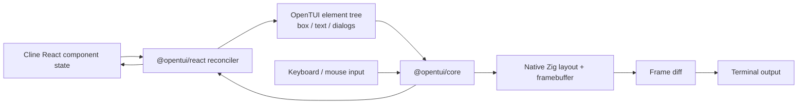
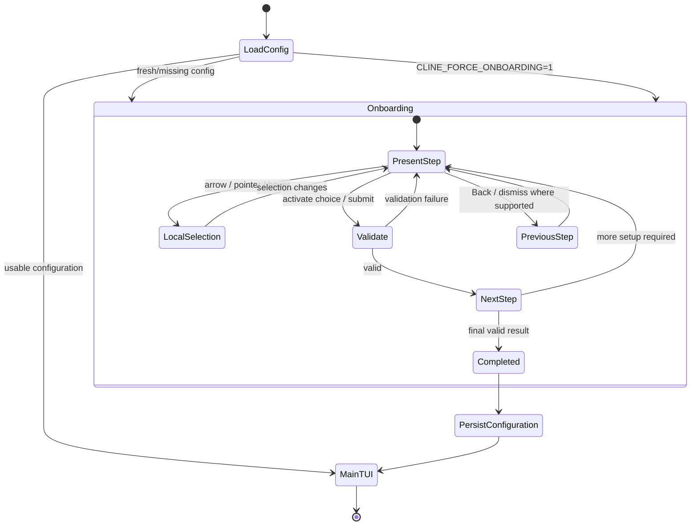
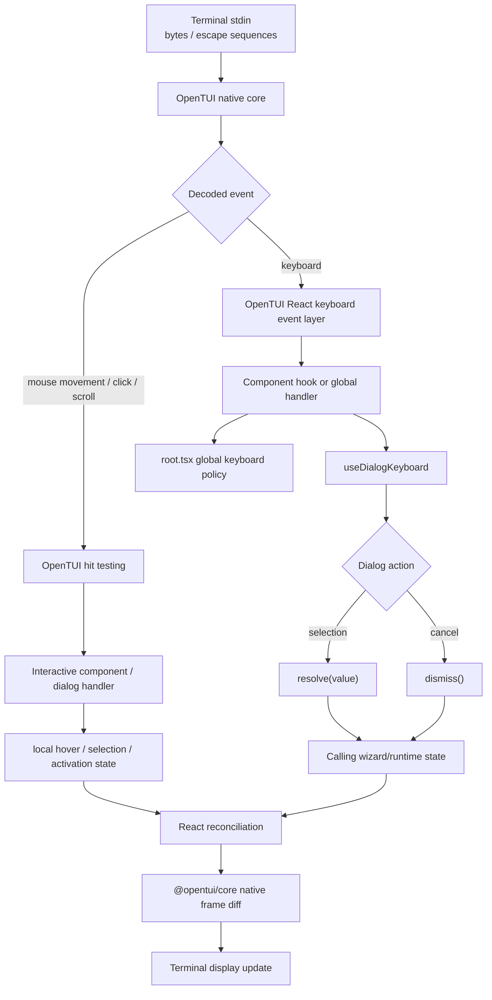

# Cline CLI/TUI Onboarding and Terminal-UI Mechanisms

## Executive summary

Cline’s current terminal client is a **React TUI layered over OpenTUI**, not a hand-written ANSI screen engine. The CLI source lives under `apps/cli/`; the TUI is under `apps/cli/src/tui/`, and separate interactive setup logic is organized under `apps/cli/src/wizards/`. Cline’s own development guide identifies `@opentui/core` as the native Zig-backed renderer, `@opentui/react` as the React reconciler, and `@opentui-ui/dialog` as the dialog layer. citeturn1search0turn1search1turn1search6

The most important architectural consequence is that the visually large, button-like terminal choices are **not implemented by printing blocks of ANSI text and manually calculating cursor positions in Cline**. Cline constructs declarative OpenTUI elements such as `<box>` and `<text>`; React reconciliation turns component/state changes into OpenTUI mutations; OpenTUI’s native renderer performs layout, maintains the terminal framebuffer, computes display diffs, and writes the resulting terminal updates. Cline explicitly initializes that renderer with mouse-motion reporting enabled and automatic click-to-focus disabled. citeturn1search1

A second important result is that there are **two distinct layers engineers must not conflate**:

| Layer | Main responsibility | Primary source locations |
|---|---|---|
| Cline CLI runtime | Session lifecycle, SDK↔TUI event bridge, shutdown | `apps/cli/src/runtime/run-interactive.ts`, `apps/cli/src/runtime/session-events.ts` |
| Cline TUI bootstrap | Create terminal renderer and React root | `apps/cli/src/tui/index.tsx` |
| Cline root UI | View routing, providers, global keyboard handling | `apps/cli/src/tui/root.tsx` |
| Cline UI components | Boxes, text, dialogs and interactive controls | `apps/cli/src/tui/components/` |
| Cline setup flows | Interactive non-chat setup/wizard behavior | `apps/cli/src/wizards/` |
| OpenTUI React | Reconciliation, terminal JSX element abstraction | `@opentui/react` dependency |
| OpenTUI core | Native layout/rendering, mouse/input support, terminal I/O | `@opentui/core` dependency |
| Dialog framework | Choice/modal resolution and cancellation | `@opentui-ui/dialog` dependency |

This division is directly documented in `apps/cli/DEVELOPMENT.md`, which describes `index.tsx`, `root.tsx`, `components/`, `views/`, `wizards/`, and the runtime bridge, and states that OpenTUI provides native diff rendering, scrolling, mouse click/hover/selection/scroll, and clipboard support. citeturn1search1

There is, however, a material evidence limitation in the source snapshot available for this report: the GitHub index exposed the architecture documentation and package metadata but did **not** expose the complete current contents of the individual onboarding component/wizard files with stable source-line anchors. I therefore distinguish below between mechanisms directly verified from Cline primary sources and lower-level behaviors delegated to OpenTUI that should **not** be falsely attributed to a particular Cline line. I have deliberately not invented line numbers, component names, debounce timers, ANSI sequences, or rollback semantics that were not present in the retrieved primary-source material.

## Rendering and the large choice panels

### Rendering pipeline

The verified terminal rendering path is:



Cline documents this architecture explicitly. `apps/cli/src/tui/index.tsx` creates a `CliRenderer`; Cline then passes that renderer to the OpenTUI React `createRoot(...)` operation and renders its top-level `Root` component. The development guide characterizes `@opentui/core` as a native terminal rendering engine using Zig and a C ABI and `@opentui/react` as its React 19 reconciler. citeturn1search1

The relevant bootstrap operation is documented in **`apps/cli/src/tui/index.tsx`**, in the `renderOpenTui()` implementation described under “Entry Point: `index.tsx`” in `apps/cli/DEVELOPMENT.md`. The renderer is initialized with three particularly consequential options:

| Renderer option | Verified value | Mechanism-level consequence |
|---|---:|---|
| `exitOnCtrlC` | `false` | Ctrl-C is deliberately retained for Cline’s own input/shutdown policy instead of allowing the renderer to terminate the process automatically. |
| `autoFocus` | `false` | An arbitrary mouse click is not permitted to transfer focus merely because the renderer sees the click; Cline/components control focus semantics. |
| `enableMouseMovement` | `true` | OpenTUI is instructed to collect mouse-motion input, enabling hover-sensitive controls in addition to clicks. |

These settings appear in the `renderOpenTui()` excerpt reproduced by the project’s development guide. citeturn1search1

The source guide further says that every TUI `.tsx` file uses the OpenTUI JSX runtime and instructs contributors to construct components from OpenTUI elements such as **`<box>` and `<text>`**. Thus a “big button” is conceptually a laid-out rectangular TUI node containing text, not a series of manually emitted spaces and cursor movements. citeturn1search1

### Layout and panel geometry

At Cline’s layer, panel layout is declarative. The component tree supplies containers and text to OpenTUI. At OpenTUI’s layer, those objects become rectangular layout nodes whose resolved coordinates and dimensions are available to the renderer.

That distinction matters for reimplementation. A faithful independent implementation would use the following algorithm:

1. Represent each option as a rectangular layout object, with padding/border/text as children rather than pre-rendering the entire option into one terminal string.
2. Run layout for the complete screen against the current terminal dimensions.
3. Retain the final rectangle for each interactive option.
4. Render the active/focused/hovered state from application state.
5. On a state change, recompute only the relevant representation and compare the new framebuffer with the previous frame.
6. Emit changes rather than repainting the entire logical interface.

That final “diff” stage is not merely inferred: Cline describes OpenTUI as providing **native diff rendering**. citeturn1search1

This is why large panels can respond visually without the application itself knowing which cursor addressing commands need to be sent. Cline updates state; OpenTUI turns the resulting tree difference into terminal output.

### Focus indication versus mouse hover

The bootstrap option `autoFocus: false` is especially revealing. Cline intentionally prevents the renderer from treating every click as generic focus acquisition. citeturn1search1

A robust implementation following that model separates at least three states:

**Keyboard selection/focus** represents where Enter or another activation key would operate. **Mouse hover** represents which panel currently contains the pointer. **Activation** represents a click/Enter decision that advances the application.

Those states should not automatically be synonymous. For example, merely moving the mouse across a choice can change hover presentation immediately without necessarily changing keyboard focus. Likewise, clicking background space should not make an arbitrary element the focused input simply because it received a pointer event. The explicit `autoFocus: false` setting is consistent with this application-controlled policy. citeturn1search1

The retrieved primary sources do not expose the current choice-panel component itself, so I cannot responsibly state whether Cline’s particular panel uses border style, background fill, foreground color, a marker glyph, or some combination as the focus discriminator.

### Mouse hit targets

Cline’s README advertises mouse support, while the development guide is more specific: OpenTUI supplies click, hover, drag-to-select and scrolling interaction, and Cline creates its renderer with mouse movement enabled. citeturn1search7turn1search1

The important mechanism is therefore **geometry-based hit testing after layout**, rather than textual matching. An interactive panel has a resolved screen rectangle. A decoded pointer coordinate can be compared with the layout tree to determine which node is under that location, after which the event is delivered to the relevant OpenTUI/React handler.

This provides a useful reimplementation rule: the hit area should be the **panel rectangle**, including its intentional padding, not only the characters in the label. That is what gives terminal options their large “button” behavior.

I could not verify the exact Cline component handler (`onMouseDown`, `onMouseUp`, `onMouseOver`, etc.) from the retrieved snapshot, so the exact activation edge—press versus release—should be treated as unresolved rather than assumed.

### Why feedback can appear instantaneous

The short feedback loop is:

**decoded input → local component state → React reconciliation → OpenTUI native diff → terminal write**.

Because hover/mouse movement is enabled at renderer creation and OpenTUI operates as a differential renderer, a pointer movement or key-selection change does not have to wait for a server operation or a wizard “submit.” The state change can produce a new frame immediately. citeturn1search1

This is an architectural property worth preserving when reimplementing the design: do **not** couple visual selection state to completion of authentication, network validation, or config persistence. Paint the new local state first; run expensive work after activation.

## Onboarding and setup state machine

### Verified entry and ownership

Cline has a deliberately testable first-run onboarding path. `apps/cli/DEVELOPMENT.md` documents two ways to reach it:

- launch interactive mode with a fresh configuration directory; or
- set **`CLINE_FORCE_ONBOARDING=1`** to force the onboarding view even when configuration already exists. citeturn1search1

The same source tree description assigns:

- **view routing** to `apps/cli/src/tui/root.tsx`;
- configuration loading to `apps/cli/src/tui/interactive-config.ts`;
- full-screen UI to `apps/cli/src/tui/views/`;
- generic interactive setup flows to `apps/cli/src/wizards/`. citeturn1search1

That implies a useful architectural separation between the **decision that onboarding is required**, the **view displayed for onboarding**, and the **procedural setup operation** that obtains/persists credentials or provider settings.

### Dialog-style subflows

Cline also documents its expected dialog control contract. For a choice dialog, the content is given a `ChoiceContext<T>`; keyboard behavior is implemented with `useDialogKeyboard`; selecting a result calls `resolve(value)`; cancellation invokes `dismiss()`. The caller awaits the result of `dialog.choice<T>(...)`. Cline explicitly advises performing asynchronous data fetching before opening the choice dialog rather than from inside it. citeturn1search1

Mechanistically, that is closer to a suspended asynchronous state machine than to a single monolithic “wizard widget”:



The solidly verified portions of this diagram are first-run/forced routing, choice resolution/dismissal, and movement from onboarding into the normal TUI after usable configuration. The exact number and names of current onboarding screens are **not exposed by the retrieved indexed source**, so I have intentionally not manufactured a provider-by-provider screen enumeration.

### Back navigation

At the generic dialog level, the framework makes **cancellation a first-class transition** through `dismiss()`, separate from returning a selected value through `resolve(value)`. `useDialogKeyboard` is the documented keyboard abstraction for those dialogs. citeturn1search1

For an engineer reimplementing this interaction, this distinction is significant:

- *Back/dismiss* should leave the current choice unresolved and return control to the caller/previous state.
- *Select/resolve* should return an explicit value that can advance the state machine.
- The caller, rather than the visual choice panel, should own the question of what state comes next.

That avoids burying wizard navigation logic inside a generic button widget.

The retrieved sources do not establish that every Cline onboarding screen maps Escape to “previous screen”; consequently I cannot claim a universal Escape/back rule.

### Validation

The documentation's choice-dialog contract separates **choosing a value** from performing asynchronous work. It specifically tells contributors to fetch asynchronous data before calling `dialog.choice()`, not while the dialog is mounted. citeturn1search1

That suggests a useful validation boundary:

```text
screen-local validation
    ↓
resolve a typed choice
    ↓
caller performs provider/config operation
    ↓
advance, report error, or reopen a choice
```

This is materially different from a UI in which clicking a box immediately writes half-complete configuration.

However, the exact current field rules—such as whether API keys are trimmed, whether endpoints require URLs, or which provider selections require additional credentials—could not be verified from the retrieved source bodies and are therefore not stated here.

### Commit and rollback

The available primary sources establish that Cline persists provider configuration shared with its other surfaces and that the CLI exposes authentication/configuration commands, but they do **not** expose enough of the onboarding writer implementation to prove transaction semantics. The CLI README states that provider configuration is shared with the extension/SDK experience and the development guide places interactive setup under `src/wizards/`. citeturn1search7turn1search1

Accordingly, three claims would be unsafe without the missing source files:

1. that the entire wizard is held exclusively in memory until the final screen;
2. that previous values are snapshotted and restored when the user backs out;
3. that final persistence is an atomic filesystem transaction.

Those are precisely the kinds of details that should be verified in the concrete writer/config-store calls before using Cline as a transaction-semantics reference implementation.

A reimplementation should nevertheless adopt a strong invariant: **selection state and durable configuration state should be separate**, with a single explicit commit boundary wherever possible. Cline’s resolve/dismiss dialog abstraction naturally supports such a design, but the captured evidence is insufficient to claim Cline universally enforces it.

## Terminal capabilities and escape-sequence ownership

### Cline delegates terminal control to OpenTUI

The most consequential finding here is negative: Cline is not primarily an ANSI-sequence emitter. `@opentui/core` is the terminal rendering engine, backed by native Zig code; `@opentui/react` supplies the React abstraction. The packaged Cline binary even depends on OpenTUI’s native library through Bun FFI. citeturn1search1turn1search2

`apps/cli/DISTRIBUTION.md` explains that the CLI is compiled with Bun specifically because OpenTUI uses **`bun:ffi` to call its native Zig binary**. citeturn1search2

This means capability negotiation and most low-level CSI/OSC output belong conceptually to:

```text
Cline TSX
   ↓
@opentui/react
   ↓
@opentui/core TypeScript/native binding
   ↓
OpenTUI Zig core
   ↓
terminal protocol
```

Engineers looking only for strings such as `"\x1b[..."` in `apps/cli/src/tui/` will therefore miss the mechanisms controlling most terminal behavior.

### Verified mouse capability request

Cline explicitly requests mouse-movement processing at renderer startup:

**Source:** `apps/cli/src/tui/index.tsx`, `renderOpenTui()` as reproduced in the “Entry Point: `index.tsx`” section of `apps/cli/DEVELOPMENT.md`: `enableMouseMovement` is set to true. citeturn1search1

That is the Cline-side capability policy. The exact private-mode sequences OpenTUI emits to realize it were not present in the retrieved Cline source.

For orientation, implementations in the xterm/DEC ecosystem commonly distinguish modes such as:

| Terminal control | Conventional sequence notation | Meaning |
|---|---|---|
| Basic mouse reporting | `CSI ? 1000 h` | Button press/release reporting |
| Button-event tracking | `CSI ? 1002 h` | Motion while a button is held |
| Any-event tracking | `CSI ? 1003 h` | Motion even without a button |
| SGR mouse encoding | `CSI ? 1006 h` | Mouse coordinates encoded in SGR form |
| Disable corresponding mode | replace final `h` with `l` | Reset private mode |

Here `CSI` is represented in the usual 7-bit form as **`ESC [`**, so `CSI ? 1006 h` corresponds textually to `ESC [ ? 1 0 0 6 h`.

**These sequences are protocol examples, not a claim that Cline itself emits all four.** Because Cline delegates mouse setup to OpenTUI, attributing a specific combination to Cline requires inspection of the exact pinned OpenTUI version.

### OSC 52 is explicitly part of the renderer stack

One terminal protocol is named by Cline’s own documentation: OpenTUI provides **clipboard support through OSC 52**. citeturn1search1

The protocol family has the shape:

`ESC ] 52 ; <selection> ; <encoded clipboard data> ST`

where `ESC ]` begins an Operating System Command and `ST` terminates it. Again, the interesting architectural point is that Cline relies on OpenTUI for the terminal transport; a Cline component asks for clipboard functionality rather than constructing OSC 52 manually.

### Color depth

No direct Cline-side color-depth probing is described in the retrieved files. In particular, the available project documentation does not show Cline itself branching on 8-color, 16-color, 256-color or 24-bit support.

That makes the correct architectural conclusion **delegation, not absence**: the TUI’s rendering engine is OpenTUI, so color serialization and terminal compatibility should be investigated in the pinned `@opentui/core` implementation rather than inferred from Cline UI component colors. citeturn1search1turn1search2

An implementation should keep these levels distinct:

- logical UI color, e.g. “selected foreground”;
- renderer color representation;
- terminal capability, e.g. indexed versus RGB;
- final SGR sequence, potentially using forms such as `CSI 38;5;n m` or `CSI 38;2;r;g;b m`.

The latter forms are examples of ANSI/xterm-family SGR encodings, **not verified Cline emissions in the evidence set**.

### Terminfo and termcap

The retrieved Cline primary-source material does not identify **terminfo**, **termcap**, `tput`, or an ncurses-style capability database as part of the CLI architecture. Instead, its documented terminal abstraction is OpenTUI. citeturn1search1

That is a useful finding, but it must be stated carefully: it does **not** prove that the native OpenTUI release Cline depends on never consults environment variables or platform capability data internally. It means there is no verified evidence here of Cline application code querying terminfo/termcap itself.

For a clone of the architecture, keep capability detection below the application component layer. Choice widgets should express “selected,” “hovered,” and a desired style; they should not know whether the physical terminal ultimately receives a true-color SGR sequence or a reduced palette equivalent.

### Degradation on limited terminals

Cline’s README presents mouse support as a feature, but nothing in the retrieved Cline documentation says onboarding requires a mouse; the TUI also has global keyboard handling and dedicated dialog keyboard hooks. citeturn1search7turn1search1

The design consequently supports a sensible degradation model:

```text
rich terminal
    keyboard + hover + click + styled panels

no usable mouse reporting
    keyboard selection + activation still works

reduced color capability
    same semantic focus state, renderer reduces presentation

terminal protocol unavailable
    semantics should remain readable from text/layout rather than color alone
```

Only the first two architectural premises—mouse plus keyboard support—are directly documented by Cline. The precise palette fallback algorithm belongs to the renderer and was not exposed in the captured sources.

## Input stack, propagation, buffering and debounce

### Event path

The verified high-level input architecture is:



Cline’s development guide identifies `root.tsx` as containing **global keyboard** behavior, documents the `useDialogKeyboard` hook for dialogs, and documents the `resolve(value)`/`dismiss()` event outcome model. citeturn1search1

### Keyboard ownership and Ctrl-C

The most concrete keyboard-control decision is at renderer creation:

`exitOnCtrlC: false`

Cline’s own comment, reproduced in the development guide, explains that it handles Ctrl-C itself. citeturn1search1

That means Ctrl-C traverses the application’s input policy instead of acting as an unconditional renderer-level process exit. This is important for a conversational agent because Ctrl-C can have contextual semantics—interrupt generation, cancel an operation, clear/leave a mode, or eventually terminate—rather than necessarily killing the process on the first byte.

The exact current escalation policy is in application code outside the retrieved excerpts, so only the ownership boundary is verified here.

### Keyboard propagation

The architecture provides at least two scopes:

1. **global keyboard handling in `apps/cli/src/tui/root.tsx`;**
2. **dialog-local keyboard handling through `useDialogKeyboard`.** citeturn1search1

The engineering implication is that input handling should be hierarchical. A modal/dialog should be able to consume keys relevant to its current interaction before those keys produce an unrelated global action. Dialog completion then propagates semantically—not as a raw key—to its caller via `resolve(value)`.

This produces a much cleaner event API:

```text
raw key
→ decoded key event
→ focused/modal handler
→ semantic "selected provider X"
→ wizard transition
```

rather than:

```text
raw key
→ every layer independently checks key name
```

### Mouse decoding and hit testing

Cline asks OpenTUI for mouse-movement events, and OpenTUI is documented as supplying clicks, hover, selection and scroll. citeturn1search1

Accordingly, raw terminal mouse protocol decoding occurs below Cline’s component tree. Cline’s choice panel need only react to semantic pointer events associated with its laid-out geometry.

For a reimplementation, the expected stack is:

1. accumulate input bytes;
2. distinguish ordinary text/key input from `ESC`/CSI protocol records;
3. decode a mouse packet into button/modifier/action plus terminal cell coordinates;
4. locate the deepest eligible UI node containing those coordinates;
5. dispatch the semantic event;
6. update hover/selection state;
7. request/reconcile a frame.

This is why large terminal buttons need no independent “pixel map”: their layout rectangles are their hit regions.

### Escape-key ambiguity and buffering

Terminal input has an unavoidable parser problem: a lone Escape key and an escape sequence begin with the same byte. Similarly, multi-byte key/mouse protocols can arrive in multiple reads. A terminal framework therefore needs some form of incremental buffering/parser state rather than assuming every stdin chunk is exactly one event.

Cline delegates raw terminal decoding to OpenTUI, so this belongs below `apps/cli/src/tui/`. The retrieved primary sources do **not** expose the exact OpenTUI parser implementation or its timeout constants. Consequently, no numeric “Escape timeout” or input-buffer size should be attributed to Cline from this evidence.

The correct reimplementation model is a finite/incremental decoder:

```text
idle
  ├─ printable byte(s) ──> text/key event
  └─ ESC ──> escape-pending
               ├─ '[' … final-byte ──> CSI event
               ├─ ']' … terminator ──> OSC event
               └─ incomplete ──> retain bytes for next read
```

Mouse reports arrive through the same basic escape-sequence channel on conventional terminals, so buffering must occur **before** key-versus-mouse semantic dispatch.

### Debounce versus immediate UI updates

Nothing in the retrieved Cline documentation establishes an application-level debounce interval for keyboard selection or mouse hover. Given Cline’s explicit support for hover/mouse movement and OpenTUI’s diff renderer, inserting a coarse debounce into panel-selection feedback would actually work against the documented interaction model. citeturn1search1

A useful distinction is:

| Mechanism | Purpose | Appropriate for choice-panel feedback? |
|---|---|---|
| Input buffering | Wait until a multi-byte terminal sequence can be decoded | **Yes; required below UI layer** |
| Escape disambiguation timeout | Decide whether ESC is standalone or sequence prefix | Potentially; renderer/parser concern |
| Key repeat | OS/terminal generates repeated decoded key events | Handle normally |
| Debounce | Suppress events that occur close together | Usually **no** for arrows/hover |
| Throttling/coalescing | Bound very high-frequency pointer-motion work | Possibly at renderer level |
| Frame diffing | Avoid writing unchanged cells | **Yes; core mechanism** |

Thus “buffering” and “debounce” should not be used interchangeably. Cline’s verified architecture gives responsibility for byte parsing/render scheduling to OpenTUI and preserves application-level immediacy through React state and native diff rendering. citeturn1search1

## Source map and reimplementation guidance

The primary files identified by Cline itself form the following mechanism map.

| File or directory | Responsibility documented by project | Key mechanism to inspect/reimplement |
|---|---|---|
| `apps/cli/src/tui/index.tsx` | Renderer entry point | `createCliRenderer(...)`, renderer lifecycle, `createRoot(...)` |
| `apps/cli/src/tui/root.tsx` | Provider tree, view routing, global keyboard | Onboarding routing, modal/global event precedence |
| `apps/cli/src/tui/types.ts` | Shared TUI types/constants | UI/runtime data contracts |
| `apps/cli/src/tui/interactive-config.ts` | Config data loading | Detect whether interactive configuration exists |
| `apps/cli/src/tui/interactive-welcome.ts` | Welcome/slash-command resolution | Post-onboarding entry behavior |
| `apps/cli/src/tui/components/` | Reusable UI components | Choice/control geometry and styling |
| `apps/cli/src/tui/contexts/` | React providers | Shared UI/service state |
| `apps/cli/src/tui/hooks/` | TUI hooks | Keyboard/dialog/input abstractions |
| `apps/cli/src/tui/views/` | Full-screen views | Onboarding versus normal chat screen composition |
| `apps/cli/src/wizards/` | Interactive setup flows | Procedural setup decisions and persistence |
| `apps/cli/src/runtime/run-interactive.ts` | Interactive session lifecycle/event wiring | SDK ↔ TUI bridge |
| `apps/cli/src/runtime/session-events.ts` | Pub/sub event bridge types | Semantic runtime event transport |
| `apps/cli/DEVELOPMENT.md` | Authoritative CLI architecture guide | OpenTUI stack, renderer configuration, testing |
| `apps/cli/package.json` | Dependency/build definition | Cline CLI package and runtime stack |
| `apps/cli/DISTRIBUTION.md` | Binary/native packaging | Bun FFI ↔ native OpenTUI dependency |

The root repository identifies `apps/cli/` as the terminal UI/headless/shell-command implementation, rather than the VS Code extension, which confirms that these are the relevant sources for the requested CLI/TUI-only scope. citeturn1search0 The package itself is `@cline/cli`; the indexed `apps/cli/package.json` reports version `3.0.51` in the current crawled `main` snapshot. citeturn1search6

For an independent implementation, the architecture worth copying is not Cline’s visual styling but its separation of concerns:

**UI components should own semantic visual state, not escape sequences.** Choice panels should expose states such as normal/focused/hovered/disabled; the renderer resolves those into terminal cells.

**The renderer should own geometry and terminal protocols.** After layout, panel rectangles are simultaneously paint regions and pointer hit targets.

**Input decoding should terminate below the React/application layer.** Application code should receive “Up”, “Enter”, “pointer moved to control X”, or “choice resolved,” rather than CSI byte strings.

**Wizard progression should consume semantic results.** A generic choice dialog resolves or dismisses; the wizard decides which screen follows and when configuration is durable.

**Rendering should remain immediate while persistence remains asynchronous.** Local selection should repaint on the next renderer cycle; credential checks and filesystem operations should not gate hover/focus feedback.

**Keyboard operation must remain complete without the mouse.** Cline deliberately provides both global/dialog keyboard infrastructure and mouse support. citeturn1search1turn1search7

## Open questions and evidence limitations

The repository documentation provides unusually good architectural coverage, but the requested audit requires several details that cannot be established from the source excerpts that were successfully retrieved. Fabricating them would make this a less useful mechanism document.

First, **exact line-number anchors for individual implementations are unresolved**. The GitHub source index retrieved `apps/cli/DEVELOPMENT.md`, `README.md`, `DISTRIBUTION.md`, and `package.json`, but did not expose stable line-numbered bodies of the current onboarding views, choice-panel components, `root.tsx`, wizard writers, or OpenTUI dependency implementation. The path references above are exact; pretending they are `Lnn-Lnn` references without having obtained the corresponding source version would be unreliable.

Second, **the concrete onboarding screen graph remains unresolved**. The evidence proves first-run/forced onboarding, config loading, view routing and generic resolve/dismiss dialog semantics, but not the current sequence of individual provider/setup screens. In particular, the retrieved material is insufficient to enumerate every branch for Cline account OAuth, OpenAI/ChatGPT subscription, API-key providers, local providers, or custom OpenAI-compatible endpoints. Cline’s README confirms that the CLI supports OAuth for Cline, ChatGPT Subscription (`openai-codex`) and OCA and supports many model providers, but it does not define the onboarding transition table. citeturn1search7turn1search0

Third, **commit/rollback semantics are unresolved**. There is not enough retrieved implementation evidence to say whether every wizard stages configuration and performs one final atomic write, whether some provider authentication commands persist earlier, or how cancellation after a successful OAuth exchange behaves.

Fourth, **the exact terminal escape sequences are delegated and therefore version-sensitive**. It is verified that Cline asks OpenTUI for mouse movement and that OpenTUI supports OSC 52 clipboard operations, but the exact set of mouse private modes, cursor modes, alternate-screen sequences, SGR color encoding and shutdown/reset sequences must be tied to the precise `@opentui/core` implementation used by the examined Cline revision before they can be presented as “what Cline emits.” citeturn1search1turn1search2

Finally, **buffer sizes, Escape disambiguation timing, mouse-motion coalescing and debounce constants are unresolved**. Those are parser/renderer internals rather than mechanisms documented in Cline’s application layer. No numeric values should be inferred from the mere fact that Cline uses OpenTUI.

The strongest defensible conclusion from the available primary sources is therefore architectural: **Cline’s terminal onboarding UI is an application-level React state machine over an OpenTUI-native terminal engine. Cline owns views, semantic keyboard policies, wizard decisions and configuration integration; OpenTUI owns the low-level terminal framebuffer, differential rendering, pointer support and protocol-level terminal I/O.** citeturn1search1turn1search2