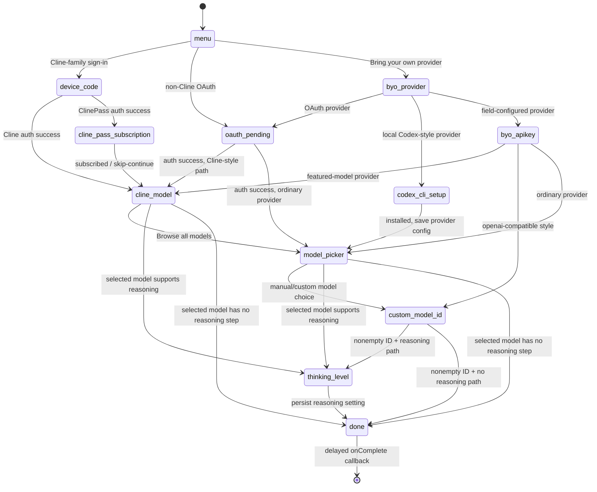

# Cline CLI/TUI Onboarding Mechanism Report

## Executive summary

This report analyzes Cline’s **CLI/TUI onboarding**, not the VS Code extension, against Cline commit `aa4753f4abc8303dcecd5d27cde622215047c21b`. At that snapshot, `apps/cli` pins `@opentui/core` and `@opentui/react` to `0.4.3`, so the lower-level rendering, terminal-detection, hit-testing, and input-decoding mechanisms are traced into the corresponding OpenTUI `v0.4.3` sources rather than inferred from terminal behavior. fileciteturn12file0

The main architectural conclusions are:

**The large onboarding choices are not terminal “buttons.”** Cline renders React/OpenTUI `<box>` trees whose selected index drives borders, foreground/background colors, icons, and arrows. For the main onboarding cards, that selected index is **not OpenTUI focus**, and the cards have **no click handler**. Cline even creates the renderer with `autoFocus: false`. The primary setup path is keyboard-first. fileciteturn29file0 fileciteturn11file0L870-L1009

**Mouse support is deliberately inconsistent across onboarding surfaces.** Mouse movement is globally enabled, principally so the onboarding robot can track the pointer. The generic searchable-list component creates cell-sized mouse hit targets and can call an item callback on `onMouseDown`, but Cline supplies that callback for the ordinary **model picker** and does not supply it for the **provider picker**. The big main-menu cards, featured Cline models, thinking-level rows, and ClinePass rows have no per-row mouse activation handler. fileciteturn27file0 fileciteturn22file0 fileciteturn24file0 fileciteturn25file0

**The onboarding wizard is a React state machine, but it is not a transaction.** `OnboardingStep` is an explicit tagged union, and a controller owns selection indices, provider/model data, auth state, form values, and transition functions. Back navigation is centralized in the keyboard hook. Crucially, provider settings, model selection, and reasoning settings are persisted **on intermediate transitions**, not staged and atomically committed on the final screen. The `done` state merely delays approximately 500 ms and invokes the parent completion callback. Thus the premise “commit configuration at end” does not match the implementation. fileciteturn15file0 fileciteturn16file0 fileciteturn19file0 fileciteturn20file0 fileciteturn21file0

**Terminal support is mostly delegated to OpenTUI.** OpenTUI maintains capability flags such as `rgb`, `ansi256`, Kitty keyboard/graphics, bracketed paste, focus tracking, synchronized update, Unicode width behavior, and others. Detection combines environment heuristics with active terminal queries such as XTVERSION, DECRQM, Kitty keyboard queries, cursor-position reports, and OSC color queries. There is no corresponding “mouse supported” Boolean in the reviewed capability structure: Cline requests mouse tracking and relies on the terminal either to honor the private modes or ignore them. fileciteturn41file0 fileciteturn51file0

**Input is a byte-framing pipeline, not a `stdin`-chunk-is-an-event design.** Raw-mode stdin feeds a byte-level `StdinParser`, which maintains state across chunks and classifies input into key, mouse, paste, or terminal-response events. Keyboard sequences then go through `parseKeypress` and OpenTUI’s prioritized key dispatcher; mouse reports go through SGR/X10 decoding, a screen-sized hit grid, renderable lookup, and parent bubbling. fileciteturn38file0 fileciteturn39file0 fileciteturn57file0L3220-L3579

## Scope and module map

Cline’s TUI entry point is `apps/cli/src/tui/index.tsx`. It creates an OpenTUI renderer with `exitOnCtrlC: false`, `autoFocus: false`, and `enableMouseMovement: true`; performs a short terminal-palette lookup; resolves the initial Cline theme; then binds React to the renderer through `createRoot(renderer)`. OpenTUI defaults that Cline does not override include mouse input enabled and alternate-screen rendering. fileciteturn29file0 fileciteturn35file0

The main implementation split is:

| Repository path | Layer | Mechanism |
|---|---|---|
| `apps/cli/src/tui/index.tsx` | Cline | Creates renderer, enables pointer-motion reporting, disables click-to-autofocus, queries terminal foreground/background, creates React root. fileciteturn29file0 |
| `apps/cli/src/tui/views/onboarding/model.ts` | Cline | Defines the onboarding step/state vocabulary, main-menu options, thinking levels, and result shape. fileciteturn15file0 |
| `apps/cli/src/tui/views/onboarding/controller.ts` | Cline | Owns React state, async provider/model/auth work, transitions, validation gates, and persistence. fileciteturn19file0 fileciteturn20file0 fileciteturn21file0 |
| `apps/cli/src/tui/views/onboarding/keyboard.ts` | Cline | Global wizard keyboard dispatcher and all explicit Back/Esc behavior. fileciteturn16file0 |
| `apps/cli/src/tui/views/onboarding/view.tsx` | Cline | Maps `state.step` to one screen component; computes compact mode and content width. fileciteturn18file0 |
| `apps/cli/src/tui/views/onboarding/screens.tsx` | Cline | Visual layout of menu cards, forms, pickers, OAuth/device-code screens, subscription UI, thinking picker, and done screen. fileciteturn23file0 fileciteturn24file0 fileciteturn25file0 |
| `apps/cli/src/tui/components/searchable-list.tsx` | Cline | Reusable filtered list, visual selection, scroll window, and optional row `onMouseDown`. fileciteturn22file0 |
| `apps/cli/src/tui/components/model-selector/cline-model-picker.tsx` | Cline | Featured Cline model rows; selection styling but no mouse activation. fileciteturn26file0 |
| `apps/cli/src/tui/components/tracked-robot.tsx` | Cline | Pointer-coordinate React state with a 30 ms movement throttle. fileciteturn27file0 |
| `packages/react/src/reconciler/host-config.ts` | OpenTUI `v0.4.3` | Turns React elements into OpenTUI renderable instances; commits mutated properties and requests a frame after React commit. fileciteturn66file0 |
| `packages/core/src/Renderable.ts` | OpenTUI `v0.4.3` | Yoga-backed layout, focus, renderable hierarchy, mouse listener registration/bubbling, and insertion into the hit grid. fileciteturn54file0 fileciteturn59file0 |
| `packages/core/src/renderer.ts` | OpenTUI `v0.4.3` | Terminal lifecycle, stdin routing, mouse dispatch, hit testing, capability response handling, and renderer scheduling. fileciteturn35file0 fileciteturn57file0L3000-L3579 |
| `packages/core/src/zig/renderer.zig` | OpenTUI `v0.4.3` | Native cell buffers, double-buffered mouse hit grids, palette conversion, ANSI-frame generation. fileciteturn46file0 fileciteturn50file0 |
| `packages/core/src/zig/terminal.zig` | OpenTUI `v0.4.3` | Terminal capability state, environment heuristics, feature setup and terminal queries. fileciteturn41file0 |
| `packages/core/src/lib/stdin-parser.ts` | OpenTUI `v0.4.3` | Incremental byte-framing state machine for keys, mouse, paste, and replies. fileciteturn38file0 |
| `packages/core/src/lib/parse.keypress.ts` | OpenTUI `v0.4.3` | Key-sequence interpretation. fileciteturn39file0 |
| `packages/core/src/lib/parse.mouse.ts` | OpenTUI `v0.4.3` | SGR and legacy X10 mouse decoding. fileciteturn37file0 |

A useful reimplementation boundary is therefore:

```text
Cline application state
        ↓
React/OpenTUI JSX
        ↓
OpenTUI React reconciler
        ↓
Renderable tree + Yoga layout
        ↓
cell buffer + hit grid
        ↓
native current/next-frame comparison
        ↓
ANSI/OSC/CSI bytes
        ↓
terminal
```

The reverse input direction is essentially:

```text
terminal bytes
        ↓
incremental StdinParser
        ↓
key | mouse | paste | terminal-response
        ↓
keyboard dispatcher or hit test
        ↓
Cline useKeyboard / renderable mouse handler
        ↓
React state transition
        ↓
next render
```

These are intentionally different paths: visible “selection” can be purely application state even though OpenTUI has an independent focus mechanism. fileciteturn63file0 fileciteturn64file0 fileciteturn59file0

## Choice panels and rendering pipeline

### The “button” is a box plus conditional styling

The main setup page in `apps/cli/src/tui/views/onboarding/screens.tsx` iterates over the menu-option array and constructs a rounded bordered `<box>` for each option. For selected option `i === selected`, Cline changes the border to its accent color, strengthens icon/text treatment, and renders a right-side arrow `→`; unselected cards use subdued theme-derived colors. The index—not a focused widget object—is therefore the primary model of selection. fileciteturn11file0L870-L1009

That distinction matters for reimplementation. A conceptual card state can be reduced to:

\[
selected_i = (i = selectedIndex)
\]

and visual attributes become a pure function such as:

\[
border_i =
\begin{cases}
accent & selected_i\\
subtle & \text{otherwise}
\end{cases}
\]

with analogous choices for foreground, icon emphasis, and the presence of the arrow. No terminal-specific “button control” is involved. fileciteturn11file0L870-L1009

The ordinary searchable rows use a slightly different selection language: selected rows get `theme.selection` as their background, `theme.textOnSelection` for text, and a leading `❯`; unselected rows retain the normal background and colors. The featured Cline model picker and thinking/subscription lists follow the same general “background plus `❯`” idiom. fileciteturn22file0 fileciteturn26file0 fileciteturn25file0

### React state becomes terminal cells

Cline calls `createRoot(renderer)` and renders its React tree into OpenTUI. In the pinned React integration, the host reconciler’s `createInstance` looks up the corresponding OpenTUI component class and constructs a renderable; React updates mutate renderable properties, and `resetAfterCommit` requests an OpenTUI frame. fileciteturn29file0 fileciteturn66file0

Renderable layout is Yoga-backed. Each visible renderable has an absolute screen position and width/height after layout; during rendering it registers that rectangle in the renderer’s hit grid. OpenTUI’s native renderer separately maintains current and next cell buffers and current/next hit grids. The hit grids are explicitly double-buffered so input never observes a partially rebuilt frame. fileciteturn54file0 fileciteturn59file0 fileciteturn46file0

The native side ultimately emits ordinary terminal SGR/cursor sequences. For example, literal foreground RGB is:

`ESC [ 38 ; 2 ; R ; G ; B m`

or escaped as `\x1b[38;2;R;G;Bm`; 256-color foreground is `\x1b[38;5;Nm`; equivalent background sequences begin `48` rather than `38`. Terminal-default foreground/background are `\x1b[39m` and `\x1b[49m`. fileciteturn42file0 fileciteturn43file0

Because Cline does not select another OpenTUI screen mode, the normal renderer configuration is alternate-screen mode, for which OpenTUI’s native sequence constants are `\x1b[?1049h` to enter and `\x1b[?1049l` to leave. fileciteturn35file0 fileciteturn43file0

### Focus is not selection

This is one of the most important implementation details.

Cline passes:

`autoFocus: false`

when creating the renderer. OpenTUI’s normal mouse dispatcher otherwise has a feature that, on an unprevented left-button-down, walks upward from the hit renderable to the nearest focusable ancestor and calls `focus()`. Cline disables that automatic behavior. fileciteturn29file0 fileciteturn57file0L3220-L3579

Consequently, the big menu’s highlighted card is **not a focused OpenTUI control**. `menuSelected` changes, React re-renders the cards, and conditional styles make the selected one look focused. Actual focus is used where text-entry widgets need keyboard ownership: provider configuration sets one `<input focused={isFocused}>`, the custom-model input is explicitly focused, and the searchable-list search box is explicitly focused. fileciteturn24file0 fileciteturn22file0

This is an effective design pattern when reproducing such an interface: keep *navigation selection* as a small application datum such as an integer or ID, and reserve *terminal focus* for controls that actually require character input.

### Mouse hit targets are broader than clickable targets

OpenTUI’s structural hit testing and Cline’s semantic click behavior must not be conflated.

At the OpenTUI layer, renderables register their rectangular screen area in a screen-sized native hit grid. Each cell stores a numeric renderable ID; `hitTest(x,y)` obtains the ID, and the TypeScript renderer resolves that ID back through `Renderable.renderablesByNumber`. Overflow/scissor regions clip those registrations. fileciteturn46file0 fileciteturn59file0 fileciteturn57file0L3220-L3579

A structural box can therefore be the result of a hit test even if it has no `onMouseDown`. When a `MouseEvent` reaches a renderable, `Renderable.processMouseEvent` invokes generic and type-specific mouse listeners, calls the renderable’s own handler, and then bubbles to the parent unless propagation was stopped. fileciteturn59file0

Cline’s onboarding makes selective use of that facility:

| Surface | Selection feedback | Per-item mouse activation | Practical result |
|---|---|---|---|
| Main “Sign in / BYO” cards | Accent rounded border, text/icon changes, `→` | **No** | Keyboard choice panel; movement can bubble to onboarding frame, but clicking a card does not select it. fileciteturn11file0L870-L1009 |
| Provider picker | Selected-row background + `❯` | `SearchableList` supports it, but provider screen does **not** provide `onItemSelect` | Click callback is effectively inert; keyboard Enter selects. fileciteturn22file0 fileciteturn24file0 |
| Ordinary model picker | Selected-row background + `❯` | **Yes**, through `SearchableList.onMouseDown` → `onItemSelect` | A model row can be activated by mouse-down. fileciteturn22file0 fileciteturn25file0 |
| Featured Cline model picker | Selection background + `❯` | **No** | Keyboard-only. fileciteturn26file0 |
| Thinking level | Selection background + `❯` | **No** | Keyboard-only. fileciteturn25file0 |
| ClinePass option rows | Selection background + `❯` | **No** | Keyboard-only. fileciteturn25file0 |

There is another subtlety in `SearchableList`: mouse-down does **not** itself assign `selected = clickedIndex`. It simply invokes `onItemSelect(item)`. Thus the clickable model picker treats a click as semantic activation, rather than “move highlight to this row and wait for a second action.” fileciteturn22file0

### “Instant” feedback means state update followed by the next renderer frame

For keyboard navigation there is no Cline-side debounce: up/down immediately call the appropriate React selection setter. React then commits changed props to OpenTUI, and the reconciler requests a renderer update. OpenTUI’s configuration describes a default cap of 60 FPS for immediate re-renders, which Cline does not override. The exact end-to-end input-to-photon latency is therefore **not specified** by Cline and depends on React scheduling, OpenTUI’s renderer scheduler, stdout delivery, and the terminal emulator; it should not be characterized as a synchronous write from the key handler. fileciteturn16file0 fileciteturn66file0 fileciteturn35file0

Mouse movement is explicitly less immediate. `useMouseTracker()` drops movement updates arriving within 30 ms of the previous accepted update before writing the new pointer coordinates into React state. That limits the decorative robot’s pointer response to roughly 33 updates per second even if the terminal reports motion faster. fileciteturn27file0

## Wizard state machine and persistence semantics

### State representation

`apps/cli/src/tui/views/onboarding/model.ts` defines the wizard’s state discriminator as the union:

`menu | oauth_pending | device_code | byo_provider | byo_apikey | codex_cli_setup | cline_pass_subscription | cline_model | model_picker | custom_model_id | thinking_level | done`.

That value is one piece of a larger controller state consisting of multiple React states: selected menu/provider/model indices, provider IDs and names, provider field values, OAuth/device state, Codex status, subscription state, Cline-model selection, thinking selection, errors, and loading flags. This is therefore a **distributed React state machine with one explicit primary state tag**, rather than a single reducer containing a fully normalized state object. fileciteturn15file0 fileciteturn19file0

`view.tsx` acts as the state-to-screen router: it switches on `state.step` and renders one of the screen components. It also computes a maximum content width from the terminal width and switches to compact presentation when terminal height is below 28 rows. fileciteturn18file0

The main control flow is:



Some provider-dependent edges are decided from provider metadata rather than being fixed solely by the screen tag. In particular, the controller distinguishes OAuth providers, local/Codex handling, Cline/ClinePass featured-model handling, OpenAI-compatible providers needing manually entered model IDs, and ordinary model catalogs. fileciteturn19file0 fileciteturn20file0

### Back navigation is explicit transition logic

Escape handling is centralized in `apps/cli/src/tui/views/onboarding/keyboard.ts`. It is not a generic “history stack.” Each state has a manually specified predecessor and cleanup procedure. fileciteturn16file0

Examples demonstrate why this matters:

- `oauth_pending → menu` aborts the in-flight OAuth process and resets auth state.
- `device_code → menu` aborts device auth and clears code, URL, error, and status state.
- `byo_apikey → byo_provider` clears/reset provider fields.
- `byo_provider → menu`.
- `codex_cli_setup → byo_provider`.
- `cline_pass_subscription → menu`.
- `cline_model → menu`.
- `custom_model_id → model_picker`.
- `thinking_level` has a provider-dependent predecessor: a Cline provider returns to featured Cline models, while other providers return to the ordinary model picker and can trigger model reloading. fileciteturn16file0

This design is straightforward but has an engineering consequence: adding a screen requires updating not merely forward transitions but the explicit Escape dispatch table. A stack-based wizard could derive “Back” automatically, but Cline’s explicit approach gives each edge an opportunity to abort asynchronous work or reset state.

### Navigation algorithms

Most fixed choice lists implement circular selection. Conceptually, for list length \(n\):

\[
down(i)=(i+1)\bmod n
\]

\[
up(i)=(i-1+n)\bmod n
\]

The same wraparound behavior is used for the main menu, subscription choices, thinking level, and searchable lists. Searchable lists additionally reset selection to zero whenever the query changes, and clamp an out-of-date selected index to the last available filtered row. fileciteturn16file0 fileciteturn22file0

`SearchableList` uses a small deterministic ranking algorithm rather than a library fuzzy matcher. It normalizes candidates by stripping characters outside `[a-z0-9.]`, then assigns the best score across label/key/search-text fields: exact match 100, prefix 90, substring 70, and ordered subsequence 30. Section ordering is retained before ranking by score. fileciteturn22file0

For long lists it materializes logical rows including section headers, finds the rendered row corresponding to the selected item, and computes a window of at most ten visible content rows. It iteratively reserves rows for `▲ N more` / `▼ N more` indicators, then centers the chosen item as much as practical. fileciteturn22file0

### Validation is intentionally narrow

The validation model is looser than a conventional installer wizard:

| Transition | Local validation / gate | Failure behavior |
|---|---|---|
| OAuth/device authentication | Authentication flow itself is authoritative | Remains in pending/error UI; Escape aborts. fileciteturn19file0 fileciteturn23file0 |
| Codex CLI setup | Requires detected `installed === true` before saving | Save function returns without advancing if unavailable. fileciteturn20file0 |
| BYO provider fields | **No required-field validation** in the wizard | Values are trimmed/normalized and persisted; provider authentication is expected to surface invalid credentials later. fileciteturn20file0 |
| Custom model ID | Trimmed value must be non-empty | Shows `"Enter a model ID"` and stays on screen. fileciteturn20file0 fileciteturn25file0 |
| Model picked from catalog | No additional textual validation | Persists chosen model and advances. fileciteturn20file0 |
| Thinking level | Choice is constrained to predefined enum | Persists enabled/effort or disabled reasoning. fileciteturn21file0 |

The BYO behavior is especially important for a reimplementation: Cline explicitly delegates credential correctness to the provider rather than attempting to duplicate provider-specific validation rules in the onboarding form. fileciteturn20file0

### There is no final atomic configuration commit

The persistence timeline is approximately:

```text
provider chosen/configured
    → persist provider settings

model selected
    → persist model and mark it last-used

reasoning selected, when applicable
    → persist reasoning configuration

done screen
    → wait about 500 ms
    → invoke onComplete(result)
```

`saveByoConfig` calls the provider-settings manager before entering model selection. `saveCodexCliConfig` similarly persists the provider before model selection. Model-selection functions persist the model immediately, with the selected provider/model becoming last-used. The reasoning step persists its setting before going to `done`. Finally, the controller’s done-state effect calls `onComplete` after approximately 500 ms. fileciteturn20file0 fileciteturn21file0

So **`done` is a completion signal, not a transaction commit point**. The already-written settings are not held in a temporary wizard object waiting for a final “Apply.” fileciteturn20file0 fileciteturn21file0

For an engineer reproducing the behavior, this means the correct conceptual model is a sequence of durable mutations:

\[
S_0 \xrightarrow{\text{provider save}} S_1
\xrightarrow{\text{model save}} S_2
\xrightarrow{\text{reasoning save}} S_3
\xrightarrow{\text{notify complete}} done
\]

rather than:

\[
draft \xrightarrow{\text{one final commit}} persistentConfig
\]

This also implies that backing out of a later screen is not equivalent to rolling back prior screens. For example, once the model has been persisted before entering the thinking-level screen, returning from thinking to model selection does not, in the reviewed controller, constitute a transaction rollback. fileciteturn16file0 fileciteturn20file0

## Terminal capability detection and degradation

### Cline’s own setup is thin

Cline requests:

- no automatic Ctrl+C exit, because the application handles Ctrl+C;
- `autoFocus: false`;
- pointer movement reporting enabled.

After renderer creation, Cline explicitly asks `renderer.getPalette({ timeout: 150 })`. Failure is caught and converted to `null`; any detected default foreground/background are passed into theme resolution, and the initial theme background can be given to the renderer before the first React frame. This means terminal color querying can improve visual integration but does not block startup if unanswered. fileciteturn29file0

Everything more substantial is OpenTUI behavior.

### Capability detection combines environment evidence and terminal queries

OpenTUI’s native `Terminal.Capabilities` includes flags for, among other things, `kitty_keyboard`, `kitty_graphics`, `rgb`, `ansi256`, Unicode width behavior, SGR pixel coordinates, color-scheme updates, explicit-width text, scaled text, sixel, focus tracking, synchronized updates, bracketed paste, hyperlinks, OSC 52 clipboard, notifications, explicit cursor positioning, and remote mode. fileciteturn41file0

The startup specification describes a staged process: construct the native renderer, inspect environment-derived capabilities, issue asynchronous terminal probes, continue startup without waiting for every answer, maintain a five-second capability-response period, and process late responses through the same stdin parser used for ordinary input. fileciteturn51file0

Representative environment heuristics in the pinned native terminal implementation include:

- `COLORTERM=truecolor` or `COLORTERM=24bit` → RGB and ANSI-256 capability.
- `TERM` containing `256color` → ANSI-256.
- Windows Terminal evidence through `WT_SESSION` → RGB and ANSI-256.
- recognized Kitty terminal response → RGB/ANSI-256 plus Kitty-related and other known features.
- on Windows ConPTY, OpenTUI supplies Windows-specific baseline assumptions such as RGB/ANSI-256 and bracketed paste. fileciteturn41file0

That is an important mechanism distinction: **truecolor support is not established by a universal “give me your color depth” request.** It is partly an evidence/heuristics problem, supplemented by terminal identity and capability reports. fileciteturn41file0 fileciteturn51file0

### Startup probes and exact sequences

OpenTUI’s query vocabulary at this version includes the following. Here `ESC` means byte `0x1B`:

| Purpose | Escape sequence |
|---|---|
| XTVERSION | `ESC [ > 0 q` = `\x1b[>0q` |
| Cursor position | `ESC [ 6 n` = `\x1b[6n` |
| DECRQM focus tracking | `\x1b[?1004$p` |
| DECRQM SGR pixel mode | `\x1b[?1016$p` |
| DECRQM bracketed paste | `\x1b[?2004$p` |
| DECRQM synchronized output | `\x1b[?2026$p` |
| DECRQM Unicode mode | `\x1b[?2027$p` |
| DECRQM color-scheme mode | `\x1b[?2031$p` |
| Kitty keyboard capability | `\x1b[?u` |
| XTGETTCAP `Ms` | `\x1bP+q4d73\x1b\` |
| Theme foreground/background | `\x1b]10;?\x07` followed by `\x1b]11;?\x07` |
| Pixel-size request | `\x1b[14t` |

The corresponding response classifier recognizes DECRPM replies of the general form `ESC[?...$y`, cursor-position reports, XTVERSION DCS responses, XTGETTCAP responses, Kitty graphics and keyboard responses, DA1, notification-capability replies, and pixel-resolution reports such as `ESC[4;height;widtht`. fileciteturn43file0 fileciteturn30file0

OpenTUI is also multiplexer-aware. Its startup/palette specification notes that tmux behavior can change how OSC queries must be sent; old tmux releases require DCS passthrough for OSC-4 palette interrogation, while special foreground/background queries use the paths tmux actually routes. Nested tmux is explicitly listed as a current gap in the upstream specification. fileciteturn32file0 fileciteturn51file0

### Palette discovery and truecolor degradation

OpenTUI can test whether indexed-palette OSC queries work by sending:

`\x1b]4;0;?\x07`

and looking for an OSC-4 response. It can then ask for palette entries with sequences like:

`\x1b]4;42;?\x07`

and ask for default/special colors through OSC 10, 11, 12, and related slots. Missing colors are normalized against an internal ANSI-256 fallback palette. fileciteturn32file0

For normal renderer output, degradation is more interesting. The native renderer’s `emitColor` follows this policy:

1. A color carrying “terminal default” intent emits SGR `39` or `49`.
2. A transparent background emits default background.
3. If the requested color has indexed intent and ANSI-256 is supported, preserve its palette slot and emit `38;5;n` / `48;5;n`.
4. If truecolor `rgb` is **not** supported but `ansi256` **is**, convert arbitrary RGB to the nearest of the current 256 palette colors.
5. Otherwise emit literal truecolor `38;2;r;g;b` / `48;2;r;g;b`. fileciteturn50file0

The nearest-palette computation is a complete scan over the 256 palette entries using squared Euclidean RGB distance:

\[
d^2=(R-R_i)^2+(G-G_i)^2+(B-B_i)^2
\]

The result is cached with a key derived from the palette epoch and the 24-bit source RGB value. If palette contents change, the epoch changes, the cache is cleared, and a repaint is forced. fileciteturn48file0 fileciteturn50file0

A noteworthy limitation follows directly from this branch structure: **the reviewed output path does not contain a separate ANSI-16 degradation branch.** When `rgb` is false *and* `ansi256` is true, it quantizes to 256 colors; if neither capability is asserted, this function falls through to truecolor emission rather than quantizing to 16 colors. That is the behavior in the pinned renderer and should not be generalized to every OpenTUI version. fileciteturn50file0

### Mouse support is requested, not positively probed

Mouse is different from color depth. The reviewed `Terminal.Capabilities` does not contain a generic `mouse` capability flag. Cline leaves OpenTUI’s `useMouse` at its default enabled value and explicitly asks for mouse movement. During terminal setup, the TypeScript renderer calls the native `enableMouse` path when mouse use is enabled. fileciteturn35file0 fileciteturn41file0 fileciteturn57file0L3000-L3219

OpenTUI defines the standard private modes required for this family of behavior:

- basic tracking: `\x1b[?1000h`, disable `\x1b[?1000l`
- button-event tracking: `\x1b[?1002h`, disable `\x1b[?1002l`
- any-event/movement tracking: `\x1b[?1003h`, disable `\x1b[?1003l`
- SGR extended mouse format: `\x1b[?1006h`, disable `\x1b[?1006l`. fileciteturn43file0

The reviewed sources establish the available modes and that Cline requests movement-enabled mouse operation; the exact byte ordering produced inside the pinned native `setMouseMode` function was not captured in the retrieved excerpt, so it would be overclaiming to state an exact combined startup string here. What is clear is that there is **no Cline-side fallback negotiation in which a failed mouse probe turns the UI into another mode**. If a terminal does not report useful mouse events, onboarding remains keyboard-operable, and most of its major choices were keyboard-only anyway. fileciteturn29file0 fileciteturn16file0

## Keyboard and mouse input stack

### Raw stdin is incrementally framed

OpenTUI puts stdin into raw mode when the stream supports `setRawMode`, installs a `data` listener, and feeds every received `Buffer` into `StdinParser.push()`, followed by `drainStdinParser()`. It does **not** assume one Node `data` event corresponds to one keyboard or mouse event. fileciteturn57file0L3220-L3579

`packages/core/src/lib/stdin-parser.ts` is explicitly a byte-level state machine. Its output vocabulary is exactly four categories:

- `key`
- `mouse`
- `paste`
- `response`. fileciteturn38file0

Its parser states cover ground text, multi-byte UTF-8, a bare Escape, SS3, ordinary CSI, SGR mouse CSI, parametric/private CSI replies, OSC, DCS, APC, and recovery states. Pending bytes live in a custom queue using start/end indices so consuming input normally advances a pointer rather than copying; once the consumed prefix grows large enough it compacts, and backing storage grows geometrically when needed. fileciteturn38file0

A separate paste collector handles bracketed paste, whose delimiters are:

- start: `\x1b[200~`
- end: `\x1b[201~`.

That avoids making a very large paste inflate the normal key-sequence queue. fileciteturn38file0

### Escape disambiguation

A legacy terminal uses the same `ESC` byte both as a standalone Escape key and as the prefix for numerous multibyte sequences. OpenTUI therefore uses a 20 ms default timeout to distinguish a lone Escape from the beginning of a sequence. fileciteturn38file0

For example:

```text
Escape key:
1B

Up:
1B 5B 41
= "\x1b[A"

Down:
1B 5B 42
= "\x1b[B"
```

`parse.keypress.ts` recognizes both CSI arrow forms such as `ESC[A` and SS3 forms such as `ESC OA`, along with xterm, rxvt, Putty, VT100 application-keypad, modifyOtherKeys, and optionally Kitty keyboard representations. fileciteturn39file0

Raw control characters are normalized into modifier-bearing key events. Ctrl+C, for example, is byte `0x03`; the parser maps control bytes `0x01`–`0x1A` to their alphabetic key identity, yielding the semantic combination Cline tests as `key.ctrl && key.name === "c"`. fileciteturn39file0 fileciteturn16file0

### Keyboard propagation has global priority over focused widgets

Parsed keys become OpenTUI `KeyEvent` objects with fields such as name, Ctrl/Alt/Shift state, raw sequence, source (`raw` or `kitty`), event type, optional code/base-code information, and `preventDefault()` / `stopPropagation()`. fileciteturn64file0

`InternalKeyHandler` deliberately runs **global listeners first**, inspecting `stopPropagation()` between them. Only afterward does it call the focused renderable’s internal listeners; a global listener can prevent the focused renderable’s default processing with `preventDefault()` or stop propagation altogether. fileciteturn64file0

OpenTUI React’s `useKeyboard()` subscribes a component callback to the global `keypress` stream. Cline’s `useOnboardingKeyboard()` is built on that hook. fileciteturn63file0 fileciteturn16file0

This explains an otherwise subtle form behavior. On the provider-config screen, the global wizard handler processes `Tab`/Shift-Tab by changing Cline’s `focusedField`, but intentionally leaves ordinary typing—and Enter on that screen—to the focused `<input>` control. The input’s `onSubmit` then executes the save function. fileciteturn16file0 fileciteturn24file0

So an equivalent dispatcher can be conceptualized as:

```text
parsed key
   │
   ├─ global/application key handlers
   │      └─ may prevent default or stop propagation
   │
   └─ focused widget handler, unless prevented
```

rather than sending every key directly to whatever widget has cursor focus. fileciteturn64file0

### Mouse decoding

OpenTUI supports both SGR extended mouse reports and legacy X10/basic reports. `MouseParser` keeps a `Set<number>` of pressed buttons so it can infer drag state from later motion reports. fileciteturn37file0

The modern SGR form is:

```text
ESC [ < Cb ; Cx ; Cy M
```

for a press/motion report and terminal `m` for release. The parser interprets:

- low two bits of `Cb`: button
- bit `0x04`: Shift
- bit `0x08`: Alt
- bit `0x10`: Ctrl
- bit `0x20`: motion
- bit `0x40`: wheel/scroll.

Coordinates on the wire are one-based and are converted to zero-based application coordinates. fileciteturn37file0

Thus a left-button press at terminal column 10, row 5 can arrive as:

```text
"\x1b[<0;10;5M"
```

and becomes approximately:

```text
type = down
button = 0
x = 9
y = 4
```

The corresponding release is:

```text
"\x1b[<0;10;5m"
```

A left-button motion code uses the `0x20` motion bit:

```text
"\x1b[<32;10;5M"
```

and, while a button is recorded in `mouseButtonsPressed`, becomes `drag`. A no-button movement commonly carries low button bits `3`, producing `Cb = 32 + 3 = 35`:

```text
"\x1b[<35;10;5M"
```

which decodes as a move. Wheel-up sets `0x40`, for example:

```text
"\x1b[<64;10;5M"
```

and becomes a `scroll` event with direction `up`. fileciteturn37file0

Legacy X10 is six bytes:

```text
ESC [ M Cb Cx Cy
```

with encoded offsets. For the same zero-based `(9,4)` position and a left press, the bytes are:

```text
1B 5B 4D 20 2A 25
```

because the parser subtracts 32 from the button byte and 33 from the coordinate bytes. It deliberately decodes the buffer through Latin-1 so high-valued X10 coordinate bytes are not corrupted by UTF-8 decoding. fileciteturn37file0

### Mouse propagation from terminal coordinate to Cline callback

After `StdinParser` emits a mouse event, OpenTUI’s renderer runs `processSingleMouseEvent`. It performs console-overlay checks if applicable, invokes native `hitTest(x,y)`, looks up the numeric hit ID in `Renderable.renderablesByNumber`, handles selection/drag capture/hover bookkeeping, and finally dispatches a `MouseEvent` to the target renderable. fileciteturn57file0L3220-L3579 fileciteturn57file0L3580-L3799

The hit grid is screen-sized and double-buffered:

```text
renderable geometry
      ↓
nextHitGrid[cell] = renderableId
      ↓ frame completes
swap current ↔ next
      ↓
mouse coordinate
      ↓
currentHitGrid[y * width + x]
      ↓
renderableId
```

That design ensures the event layer sees the geometry of a coherent completed frame rather than half of the previous layout and half of the next one. Scissor rectangles prevent overflowing/clipped children from owning invisible cells. fileciteturn46file0

Once a target is obtained, OpenTUI calls the renderable’s generic mouse listener, then its event-specific listener such as `onMouseDown`, then the renderable’s internal mouse behavior. Unless `stopPropagation()` was called, the same event bubbles upward through `parent.processMouseEvent`. fileciteturn59file0

This bubbling explains why Cline can put one `onMouseMove` on its outer `OnboardingFrame` and still track movement over nested text/card boxes. Those nested renderables can win the hit test, but movement continues upward until the frame receives it. `useMouseTracker` then throttles and stores the coordinates for the robot. fileciteturn23file0 fileciteturn27file0

Conversely, bubbling does **not** make the main cards clickable: there is no card `onMouseDown` and no parent down handler that maps a terminal coordinate back to a menu option. A structural hit target and a semantic action target are distinct. fileciteturn11file0L870-L1009

## Reimplementation implications and open limitations

The most reusable mechanism is not Cline’s JSX syntax but the separation of concerns behind it. A clean independent implementation can represent a large choice panel with an ordered option array plus a selected ID; map that ID into border/background/text attributes; maintain real text-input focus separately; and let all state changes invalidate a retained cell model. Cline demonstrates that this is sufficient to produce a convincing “large button” interface without introducing a special button primitive. fileciteturn11file0L870-L1009

For mouse support, a screen-sized integer hit grid is a particularly simple data structure. At render time, stamp the owning widget ID into every visible cell of its clipped rectangle; at input time, one indexed lookup yields the target. Double-buffering the grid makes it atomic with respect to a frame. Parent pointers then supply DOM-like bubbling without a spatial tree walk on every event. fileciteturn46file0 fileciteturn59file0

For terminal input, Cline/OpenTUI’s architecture strongly argues against decoding directly in view code. Keep a persistent byte-framing machine beneath application keybindings because `ESC`, CSI, OSC, DCS, mouse reports, UTF-8, Kitty events, capability responses, and bracketed paste can be fragmented or coalesced arbitrarily by stdin. Emit a small typed event algebra only after framing is complete. fileciteturn38file0

For the onboarding state machine, Cline’s explicit step union is easy to reason about, but the surrounding state is fragmented across many hooks and Back is hand-coded. A different implementation could preserve user-visible behavior with a single reducer containing `{step, context}` and explicit transition objects, especially if it needed traceability or deterministic tests. That would be an architectural alternative, not a description of Cline’s current controller. fileciteturn15file0 fileciteturn19file0

The most significant behavioral choice to reproduce deliberately—or deliberately change—is persistence. Cline makes intermediate writes. A system requiring cancellation semantics should instead maintain a draft, validate it, and write it transactionally at completion; doing that would **not** be behaviorally identical to Cline because Cline’s Back/exit paths do not roll back settings already persisted on earlier edges. fileciteturn20file0 fileciteturn21file0

Several details should be treated as explicitly unspecified rather than inferred:

The Cline sources do **not** specify an exact terminal emulator, exact frame-to-screen latency, or guaranteed mouse capability. OpenTUI uses environment/terminal evidence and standards-family private modes, but a terminal is free not to answer probes or honor optional modes. fileciteturn41file0 fileciteturn51file0

The reviewed OpenTUI sources expose the exact mouse-mode escape constants and establish that Cline requests movement-enabled mouse operation, but the retrieved source excerpt did not include the complete body of native `setMouseMode`; this report therefore does not assert an exact ordered concatenation of `1002`/`1003`/`1006` enable writes. fileciteturn41file0 fileciteturn43file0

Likewise, the 60-FPS renderer cap gives an upper scheduling cadence for immediate OpenTUI re-renders, not a latency guarantee. Cline contains no terminal-acknowledgement mechanism that could make “highlight visible” a synchronously observable event from application code. fileciteturn35file0

Finally, mouse accessibility should not be described broadly as “the onboarding is clickable.” At this snapshot it is better characterized as **keyboard-primary, pointer-aware, with selective click activation**: global pointer motion powers the robot; ordinary model-search rows have a real mouse activation path; most large onboarding choice panels do not. fileciteturn27file0 fileciteturn22file0 fileciteturn11file0L870-L1009